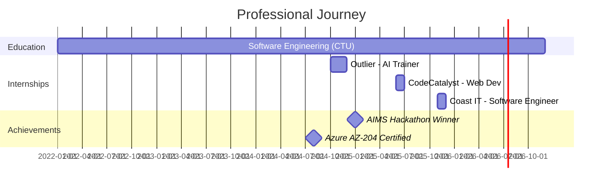

<div align="center">

<!-- Glitch Effect Header -->


</div>

```
╔══════════════════════════════════════════════════════════════════════════════╗
║                                                                              ║
║   >> SYSTEM INITIALIZING...                                          [OK]   ║
║   >> LOADING PROFILE DATA...                                         [OK]   ║
║   >> CONNECTING TO GITHUB SERVERS...                                 [OK]   ║
║   >> DEPLOYING PORTFOLIO...                                          [OK]   ║
║                                                                              ║
║   ┌─────────────────────────── DEVELOPER PROFILE ───────────────────────┐   ║
║   │                                                                     │   ║
║   │  NAME:     Nicolette Mashaba                                       │   ║
║   │  ROLE:     Software Engineer | Flutter Specialist                 │   ║
║   │  LEVEL:    Mid-Journey Developer [████████░░] 80%                 │   ║
║   │  STATUS:   🟢 AVAILABLE FOR OPPORTUNITIES                          │   ║
║   │  LOCATION: Polokwane, ZA 🇿🇦 | TIMEZONE: GMT+2                     │   ║
║   │                                                                     │   ║
║   │  SPECIALIZATION:                                                   │   ║
║   │  ├─ Full-Stack Sorcery (MERN, .NET)                               │   ║
║   │  ├─ Mobile Magic (Flutter/Dart)                                   │   ║
║   │  ├─ Cloud Architecture (Azure ☁️)                                  │   ║
║   │  └─ AI Integration (OpenAI API)                                   │   ║
║   │                                                                     │   ║
║   │  LATEST ACHIEVEMENT: 🏆 AIMS Hackathon 2025 WINNER               │   ║
║   │                                                                     │   ║
║   └─────────────────────────────────────────────────────────────────────┘   ║
║                                                                              ║
╚══════════════════════════════════════════════════════════════════════════════╝
```

<div align="center">

[](https://nickimash.vercel.app/)
[](mailto:nene171408@gmail.com)
[](https://www.linkedin.com/in/nicolette-mashaba-b094a5221/)
[](https://x.com/m_neyi)


</div>

---


## 🎮 PLAYER STATS

```javascript
class NicoletteMashaba extends Developer {
  constructor() {
    super();
    this.username = "NickiMash17";
    this.location = "Polokwane, South Africa 🇿🇦";
    this.dayOfBirthTimestamp = "ERROR: CLASSIFIED";
    this.currentWorkplace = "Coast IT (PTY) Ltd";
  }

  get skills() {
    return {
      languages: ["JavaScript", "TypeScript", "Python", "C#", "Dart", "SQL"],
      frontend: ["React", "Flutter", "HTML5", "CSS3", "Tailwind"],
      backend: ["Node.js", "Express", ".NET Core", "ASP.NET"],
      databases: ["MongoDB", "SQL Server", "Prisma ORM"],
      cloud: ["Microsoft Azure", "Docker", "Kubernetes", "Terraform"],
      tools: ["Git", "Azure DevOps", "Postman", "VS Code"],
      ai_ml: ["OpenAI API", "NLP", "Machine Learning"]
    };
  }

  get achievements() {
    return [
      "🏆 AIMS Hackathon 2025 Winner (Team Firefly)",
      "☁️ Microsoft Azure Developer Associate (AZ-204)",
      "📊 Azure Data Fundamentals (DP-900)",
      "⭐ CTU Top Performer 2023",
      "💼 3x Professional Internships"
    ];
  }

  getCurrentActivity() {
    return {
      workingOn: "Building cross-platform mobile apps with Flutter",
      learning: "Advanced Kubernetes orchestration & AI integration",
      collaborating: "Open source projects & hackathon teams",
      askMeAbout: ["React", "Flutter", "Azure", "Full-stack dev", "Career tips"]
    };
  }

  getLifePhilosophy() {
    return "while(alive) { eat(); sleep(); code(); repeat(); }";
  }
}

const nicolette = new NicoletteMashaba();
console.log(nicolette.getCurrentActivity());
// Output: Currently building amazing things... 🚀
```

<br clear="right"/>

---

## 🌌 TECH UNIVERSE

<div align="center">

<table>
<tr>
<td width="50%" valign="top">

### ⚡ FRONTEND REALM

<div align="center">


</div>

### 🔥 BACKEND REALM

<div align="center">


</div>

</td>
<td width="50%" valign="top">

### 🗄️ DATABASE DIMENSION

<div align="center">


</div>

### ☁️ CLOUD COSMOS

<div align="center">


</div>

### 🤖 AI LABORATORY

<div align="center">


</div>

</td>
</tr>
</table>

</div>

---

## 💼 EXPERIENCE TIMELINE



<table>
<tr>
<td width="33%" align="center">

### 🚀 COAST IT (PTY) LTD
**Software Engineering Intern**  
*Nov 2025 - Present*

```diff
+ Flutter mobile development
+ Agile team collaboration
+ Production app delivery
+ Cross-platform expertise
```

</td>
<td width="33%" align="center">

### 💻 CODECATALYST
**Web Developer Intern**  
*Jun 2025 - Jul 2025*

```diff
+ MERN stack applications
+ JWT authentication
+ 20% faster reporting
+ RESTful API design
```

</td>
<td width="33%" align="center">

### 🤖 OUTLIER
**AI Model Trainer**  
*Oct 2024 - Dec 2024*

```diff
+ 100+ AI prompts refined
+ 25% accuracy boost
+ 10hrs/week saved
+ Model optimization
```

</td>
</tr>
</table>

---

## 🎯 FEATURED MISSIONS

<div align="center">

### 🏆 MISSION #001: AI COMPLIANCE INTERROGATOR
**STATUS: COMPLETED | ACHIEVEMENT UNLOCKED: HACKATHON WINNER 🥇**


</div>

```
┌─────────────────────────── MISSION BRIEFING ───────────────────────────┐
│                                                                         │
│  OBJECTIVE:  Develop AI-powered tool to combat human trafficking       │
│  TEAM:       Firefly Squad                                             │
│  RESULT:     🥇 AIMS Hackathon 2025 Winner                             │
│  IMPACT:     Automated data analysis for law enforcement               │
│                                                                         │
│  TECH STACK:                                                            │
│  ├─ Frontend:  React + TypeScript + Modern UI                          │
│  ├─ Backend:   .NET Core + RESTful APIs                                │
│  ├─ Database:  SQL Server                                              │
│  ├─ AI:        OpenAI API + NLP Processing                             │
│  └─ Cloud:     Microsoft Azure                                         │
│                                                                         │
│  KEY FEATURES:                                                          │
│  ✓ Real-time data interrogation                                        │
│  ✓ Natural language processing                                         │
│  ✓ Interactive dashboard visualization                                 │
│  ✓ Secure cloud deployment                                             │
│  ✓ Automated alert system                                              │
│                                                                         │
└─────────────────────────────────────────────────────────────────────────┘
```

<div align="center">

### 🌐 MISSION #002: FULL-STACK WEB EMPIRE
**STATUS: DEPLOYED | PERFORMANCE: EXCEPTIONAL ⚡**


</div>

```
┌─────────────────────────── MISSION BRIEFING ───────────────────────────┐
│                                                                         │
│  OBJECTIVE:  Build production-ready MERN applications                  │
│  DURATION:   CodeCatalyst Internship (2 months)                        │
│  RESULT:     Multiple enterprise-level deployments                     │
│  IMPACT:     20% improvement in report generation speed                │
│                                                                         │
│  TECH STACK:                                                            │
│  ├─ Frontend:  React + Tailwind CSS                                    │
│  ├─ Backend:   Node.js + Express.js                                    │
│  ├─ Database:  MongoDB + Mongoose                                      │
│  ├─ Auth:      JWT + bcrypt                                            │
│  └─ APIs:      RESTful architecture                                    │
│                                                                         │
│  ACHIEVEMENTS:                                                          │
│  ✓ Built 5+ production applications                                    │
│  ✓ Implemented secure authentication                                   │
│  ✓ Integrated payment systems (Stripe)                                 │
│  ✓ Created responsive mobile-first UIs                                 │
│  ✓ Deployed with CI/CD pipelines                                       │
│                                                                         │
└─────────────────────────────────────────────────────────────────────────┘
```

<div align="center">

### 📱 MISSION #003: FLUTTER MOBILE CONQUEST
**STATUS: IN PROGRESS | LEVEL: ADVANCING 📈**


</div>

```
┌─────────────────────────── MISSION BRIEFING ───────────────────────────┐
│                                                                         │
│  OBJECTIVE:  Master cross-platform mobile development                  │
│  LOCATION:   Coast IT (PTY) Ltd                                        │
│  STATUS:     Active deployment phase                                   │
│  IMPACT:     Building production mobile applications                   │
│                                                                         │
│  TECH STACK:                                                            │
│  ├─ Framework:  Flutter + Dart                                         │
│  ├─ State:      Provider pattern                                       │
│  ├─ Backend:    Firebase + REST APIs                                   │
│  ├─ UI:         Material Design                                        │
│  └─ Tools:      Android Studio + VS Code                               │
│                                                                         │
│  CURRENT PROGRESS:                                                      │
│  ✓ Cross-platform app architecture                                     │
│  ✓ State management implementation                                     │
│  ✓ API integration & data persistence                                  │
│  ✓ Material Design UI components                                       │
│  ⏳ Play Store deployment (Coming Soon)                                │
│                                                                         │
└─────────────────────────────────────────────────────────────────────────┘
```

---

## 📊 PERFORMANCE METRICS

<div align="center">


### 🏆 ACHIEVEMENT SHOWCASE


</div>

---

## 🎓 CREDENTIALS & CERTIFICATIONS

<div align="center">

<table>
<tr>
<td align="center" width="25%">
<br>
<b>AZ-204</b><br>
<sub>Azure Developer Associate</sub><br>
⭐⭐⭐⭐⭐
</td>
<td align="center" width="25%">
<br>
<b>DP-900</b><br>
<sub>Data Fundamentals</sub><br>
⭐⭐⭐⭐⭐
</td>
<td align="center" width="25%">
<br>
<b>AIMS 2025</b><br>
<sub>Best Application</sub><br>
🏆🥇
</td>
<td align="center" width="25%">
<br>
<b>Excellence</b><br>
<sub>2023 Recognition</sub><br>
⭐⭐⭐⭐⭐
</td>
</tr>
</table>

</div>

---

## 📡 COMMUNICATION CHANNELS

<div align="center">

```
╔════════════════════════════════════════════════════════════════╗
║                                                                ║
║         🌐 READY TO COLLABORATE? LET'S BUILD! 🚀              ║
║                                                                ║
║  ┌──────────────────────────────────────────────────────────┐ ║
║  │                                                          │ ║
║  │  📧 PRIMARY:    nene171408@gmail.com                    │ ║
║  │  💼 LINKEDIN:   linkedin.com/in/nicolette-mashaba       │ ║
║  │  🌐 PORTFOLIO:  nickimash.vercel.app                    │ ║
║  │  🐦 TWITTER:    @m_neyi                                 │ ║
║  │  💻 GITHUB:     github.com/NickiMash17                  │ ║
║  │                                                          │ ║
║  │  STATUS:        🟢 AVAILABLE FOR OPPORTUNITIES          │ ║
║  │  RESPONSE TIME: ⚡ Usually within 24 hours               │ ║
║  │                                                          │ ║
║  └──────────────────────────────────────────────────────────┘ ║
║                                                                ║
╚════════════════════════════════════════════════════════════════╝
```

### 💬 CURRENT AVAILABILITY

```diff
+ Full-time Software Engineering Positions
+ Freelance Development Projects
+ Open Source Collaborations
+ Hackathon Team Formations
+ Tech Mentorship Opportunities
- Not available for unpaid "exposure" projects
```

</div>

---

<div align="center">

### 🎮 BONUS LEVEL: FUN FACTS


```javascript
const funFacts = {
  code_editor: "VS Code with 47 extensions (yes, I counted)",
  debug_method: "console.log() enthusiast & rubber duck whisperer",
  favorite_language: "JavaScript (but TypeScript is growing on me)",
  coffee_consumed: "ERROR: INTEGER OVERFLOW",
  bugs_created: "Classified information",
  bugs_fixed: "Significantly more than bugs_created (probably)",
  life_motto: "Code, caffeine, conquer, repeat",
  superpower: "Can center a div... most of the time",
  kryptonite: "Merge conflicts on Friday 5pm",
  spirit_animal: "🦅 Eagle (I spot bugs from miles away)"
};

console.log("Thanks for visiting! 🚀");
```

</div>

---

<div align="center">


### 💭 DEVELOPER PHILOSOPHY

**"First, solve the problem. Then, write the code." - John Johnson**

<sub>🌟 If you find my work interesting, consider starring some repos!</sub>  
<sub>🔔 Currently seeking opportunities in Software Engineering | Graduating 2026</sub>  
<sub>📍 Based in Polokwane, South Africa 🇿🇦 | Open to remote work</sub>

<br>


**[⬆ Back to Top](#)**

</div>
