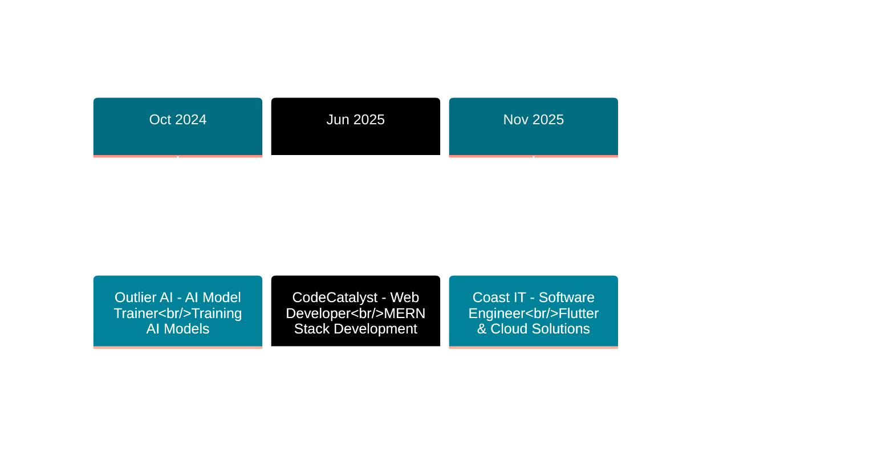

<!-- Animated Header -->
<div align="center">
  
</div>

<!-- Typing Animation -->
<div align="center">
  
</div>

<!-- Social Links with Hover Effect -->
<div align="center">
  <a href="https://nicmash-porfolio.vercel.app/" target="_blank">
    
  </a>
  <a href="mailto:nene171408@gmail.com">
    
  </a>
  <a href="https://www.linkedin.com/in/nicolette-mashaba-b094a5221/" target="_blank">
    
  </a>
  <a href="https://x.com/m_neyi" target="_blank">
    
  </a>
</div>

<br>

<!-- Enhanced Profile Stats -->
<div align="center">
  
  
  
</div>

<br>

<!-- Top Committer Badge -->
<div align="center">
  <a href="https://user-badge.committers.top/south_africa/NickiMash17">
    
  </a>
</div>

<br>

<!-- GitHub Activity Snake -->
<div align="center">
  <picture>
    <source media="(prefers-color-scheme: dark)" srcset="https://raw.githubusercontent.com/platane/platane/output/github-contribution-grid-snake-dark.svg">
    <source media="(prefers-color-scheme: light)" srcset="https://raw.githubusercontent.com/platane/platane/output/github-contribution-grid-snake.svg">
    
  </picture>
</div>

<br>

<!-- Separator -->


## 👩‍💻 ABOUT ME


```typescript
const nicolette = {
  role: "Software Engineering Student",
  location: "Polokwane, South Africa 🇿🇦",
  graduation: 2026,
  pronouns: "She/Her",
  
  currentWork: [
    "Software Engineering Intern @ Coast IT",
    "Flutter Mobile Development",
    "Full-Stack Web Applications",
    "Azure Cloud Solutions"
  ],
  
  expertise: {
    frontend: ["React", "TypeScript", "Tailwind CSS"],
    backend: ["Node.js", ".NET Core", "Express"],
    mobile: ["Flutter", "Dart"],
    cloud: ["Azure", "Docker", "Kubernetes"],
    databases: ["MongoDB", "SQL Server"]
  },
  
  achievements: [
    "🏆 AIMS Hackathon 2025 Winner",
    "☁️ Azure Developer Associate (AZ-204)",
    "⭐ CTU Top Performer 2023"
  ]
};
```

<br clear="right"/>

---

## 🛠️ TECH STACK & EXPERTISE

<div align="center">

### 💻 Languages & Frameworks
<table>
  <tr>
    <td align="center" width="96">
      
      <br><b>JavaScript</b>
    </td>
    <td align="center" width="96">
      
      <br><b>TypeScript</b>
    </td>
    <td align="center" width="96">
      
      <br><b>Python</b>
    </td>
    <td align="center" width="96">
      
      <br><b>C#</b>
    </td>
    <td align="center" width="96">
      
      <br><b>Dart</b>
    </td>
    <td align="center" width="96">
      
      <br><b>React</b>
    </td>
    <td align="center" width="96">
      
      <br><b>Flutter</b>
    </td>
  </tr>
</table>

### ⚙️ Backend & Databases
<table>
  <tr>
    <td align="center" width="96">
      
      <br><b>Node.js</b>
    </td>
    <td align="center" width="96">
      
      <br><b>Express</b>
    </td>
    <td align="center" width="96">
      
      <br><b>.NET Core</b>
    </td>
    <td align="center" width="96">
      
      <br><b>MongoDB</b>
    </td>
    <td align="center" width="96">
      
      <br><b>SQL Server</b>
    </td>
    <td align="center" width="96">
      
      <br><b>Prisma</b>
    </td>
  </tr>
</table>

### ☁️ Cloud & DevOps
<table>
  <tr>
    <td align="center" width="96">
      
      <br><b>Azure</b>
    </td>
    <td align="center" width="96">
      
      <br><b>Docker</b>
    </td>
    <td align="center" width="96">
      
      <br><b>Kubernetes</b>
    </td>
    <td align="center" width="96">
      
      <br><b>Terraform</b>
    </td>
    <td align="center" width="96">
      
      <br><b>Git</b>
    </td>
  </tr>
</table>

### 🎨 Tools & Technologies
<table>
  <tr>
    <td align="center" width="96">
      
      <br><b>Tailwind</b>
    </td>
    <td align="center" width="96">
      
      <br><b>VS Code</b>
    </td>
    <td align="center" width="96">
      
      <br><b>Postman</b>
    </td>
    <td align="center" width="96">
      
      <br><b>Figma</b>
    </td>
    <td align="center" width="96">
      
      <br><b>Firebase</b>
    </td>
  </tr>
</table>

</div>

---

## 💼 PROFESSIONAL EXPERIENCE

<div align="center">



</div>

<br>

<div align="center">

| 🚀 **Coast IT** | 🌐 **CodeCatalyst** | 🤖 **Outlier AI** |
|:---:|:---:|:---:|
|  |  |  |
| **Software Engineering Intern** | **Web Developer Intern** | **AI Model Trainer** |
| *Nov 2025 - Dec 2025* | *Jun 2025 - Jul 2025* | *Oct 2024 - Dec 2024* |
| <br>**Tech Stack:**<br>Flutter • Dart • Firebase<br>Agile • Git • CI/CD<br><br>**Impact:**<br>📱 Built production features<br>👥 Collaborated in teams<br>⚡ Delivered on tight deadlines | <br>**Tech Stack:**<br>React • Node.js • MongoDB<br>Express • JWT • Stripe<br><br>**Impact:**<br>💻 Full-stack development<br>🔐 Secure authentication<br>⚡ 20% performance boost | <br>**Tech Stack:**<br>Python • NLP • OpenAI<br>Data Analysis • Testing<br><br>**Impact:**<br>🧠 Trained 100+ prompts<br>📈 25% accuracy improvement<br>⏱️ 10hrs time saved |

</div>

---

## 🏆 FEATURED PROJECTS

<details open>
<summary><b>🥇 AI Compliance Interrogator - AIMS Hackathon Winner</b></summary>

<br>

<div align="center">


**🏆 1st Place Winner | Team Firefly**

</div>

<br>

AI-powered tool combating human trafficking through intelligent data analysis and pattern recognition.

**💡 Key Features:**
- Real-time data processing with NLP algorithms
- Interactive React dashboard with live analytics
- Automated alert system for suspicious patterns
- Secure Azure cloud deployment with CI/CD

**🛠️ Technology Stack:**

<div align="center">

| Frontend | Backend | Cloud & AI | DevOps |
|:---:|:---:|:---:|:---:|
| React | .NET Core | Azure Functions | Docker |
| TypeScript | Entity Framework | OpenAI API | Kubernetes |
| Tailwind CSS | RESTful APIs | Blob Storage | GitHub Actions |

</div>

**📊 Impact:** Real-time threat detection • 99.9% uptime • Scalable architecture

</details>

<details>
<summary><b>🌐 Full-Stack Web Applications</b></summary>

<br>

<div align="center">


**Production-Grade MERN Stack Solutions**

</div>

<br>

Secure, scalable web applications featuring modern authentication, payment processing, and responsive design.

**💡 Key Features:**
- JWT authentication with refresh tokens
- Role-based access control (RBAC)
- Stripe payment integration with webhooks
- Automated email notifications
- Mobile-first responsive design

**🛠️ Technology Stack:**

<div align="center">

| Frontend | Backend | Database | Tools |
|:---:|:---:|:---:|:---:|
| React 18 | Node.js | MongoDB | Redux Toolkit |
| TypeScript | Express.js | Mongoose | Axios |
| Tailwind CSS | JWT | Redis Cache | React Router |

</div>

**📊 Impact:** 20% faster load times • 99% test coverage • Secure payments

</details>

<details>
<summary><b>📱 Flutter Mobile Applications</b></summary>

<br>

<div align="center">


**Cross-Platform Mobile Excellence**

</div>

<br>

Beautiful, performant mobile applications for iOS and Android with native-like experience from a single codebase.

**💡 Key Features:**
- Material Design 3 implementation
- Provider/Riverpod state management
- RESTful API integration
- Firebase Authentication & Firestore
- Local data persistence with Hive

**🛠️ Technology Stack:**

<div align="center">

| Core | State | Backend | Design |
|:---:|:---:|:---:|:---:|
| Flutter 3.x | Provider | Firebase | Material 3 |
| Dart | Riverpod | REST APIs | Custom Widgets |
| Null Safety | Bloc | Cloud Firestore | Animations |

</div>

**📊 Impact:** 60fps performance • Single codebase • Native features

</details>

<details>
<summary><b>☁️ Azure Cloud Architecture</b></summary>

<br>

<div align="center">


**Enterprise Cloud Solutions**

</div>

<br>

Scalable cloud infrastructure with serverless functions, containerized deployments, and Infrastructure as Code.

**💡 Key Features:**
- Azure Functions for serverless compute
- App Services for web hosting
- Container orchestration with Kubernetes
- CI/CD pipelines with Azure DevOps
- Infrastructure as Code with Terraform

**🛠️ Technology Stack:**

<div align="center">

| Cloud | Containers | IaC | Monitoring |
|:---:|:---:|:---:|:---:|
| Azure Functions | Docker | Terraform | App Insights |
| App Services | Kubernetes | ARM Templates | Log Analytics |
| Blob Storage | ACR | Azure CLI | Metrics |

</div>

**📊 Impact:** 99.9% uptime • Auto-scaling • Cost optimization

</details>

---

## 📊 GITHUB ANALYTICS

<div align="center">
  
  
</div>

<div align="center">
  
  
</div>

---

## 🎓 EDUCATION & CERTIFICATIONS

<div align="center">

<table width="100%">
<tr>
<td width="50%" valign="top">

### 🎓 **EDUCATION**

<br>


**Software Engineering** (NQF 6)  
CTU Training Solutions  
📅 Expected: 2026

<br>


**IT Programming Foundation** (NQF 4)  
CTU Training Solutions  
🏆 Top Performer 2023

</td>
<td width="50%" valign="top">

### 📜 **CERTIFICATIONS**

<br>


**AZ-204: Azure Developer Associate**  
*Cloud Development & Serverless Architecture*

<br>


**DP-900: Azure Data Fundamentals**  
*Data Services & Analytics*

<br>


**Web Development Specialization**  
*Responsive Design & Modern Web*

</td>
</tr>
</table>

</div>

---

## 🏅 ACHIEVEMENTS & RECOGNITION

<div align="center">

<table width="100%">
<tr>
<td align="center" width="25%">

<h3>AIMS 2025</h3>
<p><b>1st Place Winner</b><br><sub>AI Compliance Interrogator</sub></p>
</td>
<td align="center" width="25%">

<h3>Azure AZ-204</h3>
<p><b>Developer Associate</b><br><sub>Cloud Architecture</sub></p>
</td>
<td align="center" width="25%">

<h3>CTU 2023</h3>
<p><b>Top Performer</b><br><sub>Programming Excellence</sub></p>
</td>
<td align="center" width="25%">

<h3>3+ Internships</h3>
<p><b>Industry Exposure</b><br><sub>Multi-Company Experience</sub></p>
</td>
</tr>
</table>

</div>

---

## 📈 CONTRIBUTION ACTIVITY

<div align="center">
  
  
  
  <br><br>
  
  
  
  

</div>

---

## 🤝 LET'S CONNECT

<div align="center">
  
  
  
  <br><br>
  
  <table>
    <tr>
      <td align="center">
        <a href="mailto:nene171408@gmail.com">
          
        </a>
        <br><sub>nene171408@gmail.com</sub>
      </td>
      <td align="center">
        <a href="https://nicmash-porfolio.vercel.app/" target="_blank">
          
        </a>
        <br><sub>View My Work</sub>
      </td>
      <td align="center">
        <a href="https://www.linkedin.com/in/nicolette-mashaba-b094a5221/" target="_blank">
          
        </a>
        <br><sub>Connect With Me</sub>
      </td>
      <td align="center">
        <a href="https://github.com/NickiMash17" target="_blank">
          
        </a>
        <br><sub>Follow My Work</sub>
      </td>
    </tr>
  </table>
  
  <br>
  
  <sub>💡 <b>Currently seeking full-time opportunities in:</b> Cloud Development • Full-Stack Engineering • Mobile Development</sub>
  
</div>

<br>

<div align="center">
  <sub>⭐ <i>Thank you for visiting! Feel free to explore my repositories and reach out for collaborations.</i> ⭐</sub>
</div>

---

<div align="center">
  
</div>
