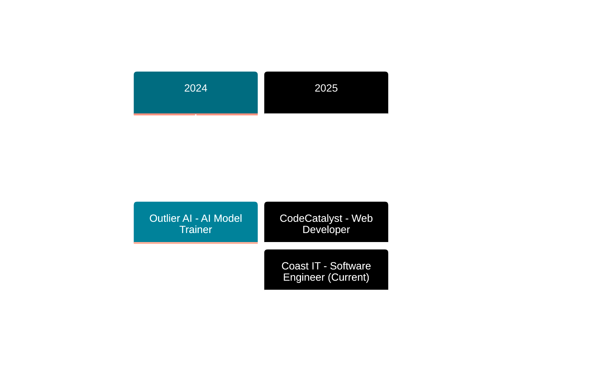

<!-- Animated Header -->
<div align="center">
  
</div>

<!-- Typing Animation -->
<div align="center">
  
</div>

<!-- Social Links -->
<div align="center">
  <a href="https://nickimash.vercel.app/" target="_blank">
    
  </a>
  <a href="mailto:nene171408@gmail.com">
    
  </a>
  <a href="https://www.linkedin.com/in/nicolette-mashaba-b094a5221/" target="_blank">
    
  </a>
  <a href="https://x.com/m_neyi" target="_blank">
    
  </a>
</div>

<br>

<!-- Profile Stats -->
<div align="center">
  
  
</div>

<br>

<!-- Top Committer Badge -->
<div align="center">
  <a href="https://user-badge.committers.top/south_africa/NickiMash17">
    
  </a>
</div>

<br>

<!-- Pacman Game -->
<div align="center">
  <h2>🎮 Watch Pacman Eat My Contributions! 🎮</h2>
  <picture>
    <source media="(prefers-color-scheme: dark)" srcset="https://raw.githubusercontent.com/platane/platane/output/github-contribution-grid-snake-dark.svg">
    <source media="(prefers-color-scheme: light)" srcset="https://raw.githubusercontent.com/platane/platane/output/github-contribution-grid-snake.svg">
    
  </picture>
</div>

<br>

<div align="center">
  
</div>

## 👩‍💻 **ABOUT ME**


```typescript
const nicolette = {
  role: "Software Engineering Student",
  location: "Polokwane, South Africa 🇿🇦",
  graduation: 2026,
  pronouns: "She/Her",
  
  currentWork: [
    "Software Engineering Intern @ Coast IT",
    "Flutter Mobile Development",
    "Full-Stack Web Applications",
    "Azure Cloud Solutions"
  ],
  
  expertise: {
    frontend: ["React", "TypeScript", "Tailwind CSS"],
    backend: ["Node.js", ".NET Core", "Express"],
    mobile: ["Flutter", "Dart"],
    cloud: ["Azure", "Docker", "Kubernetes"],
    databases: ["MongoDB", "SQL Server"]
  },
  
  achievements: [
    "🏆 AIMS Hackathon 2025 Winner",
    "☁️ Azure Developer Associate (AZ-204)",
    "⭐ CTU Top Performer 2023"
  ]
};
```

<br clear="right"/>

---

## 🛠️ **TECH STACK**

<div align="center">

### Languages & Frameworks
<table>
  <tr>
    <td align="center" width="96">
      <a href="#tech-stack">
        
      </a>
      <br>JavaScript
    </td>
    <td align="center" width="96">
      <a href="#tech-stack">
        
      </a>
      <br>TypeScript
    </td>
    <td align="center" width="96">
      <a href="#tech-stack">
        
      </a>
      <br>Python
    </td>
    <td align="center" width="96">
      <a href="#tech-stack">
        
      </a>
      <br>C#
    </td>
    <td align="center" width="96">
      <a href="#tech-stack">
        
      </a>
      <br>Dart
    </td>
    <td align="center" width="96">
      <a href="#tech-stack">
        
      </a>
      <br>React
    </td>
    <td align="center" width="96">
      <a href="#tech-stack">
        
      </a>
      <br>Flutter
    </td>
  </tr>
</table>

### Backend & Databases
<table>
  <tr>
    <td align="center" width="96">
      <a href="#tech-stack">
        
      </a>
      <br>Node.js
    </td>
    <td align="center" width="96">
      <a href="#tech-stack">
        
      </a>
      <br>Express
    </td>
    <td align="center" width="96">
      <a href="#tech-stack">
        
      </a>
      <br>.NET
    </td>
    <td align="center" width="96">
      <a href="#tech-stack">
        
      </a>
      <br>MongoDB
    </td>
    <td align="center" width="96">
      <a href="#tech-stack">
        
      </a>
      <br>SQL Server
    </td>
    <td align="center" width="96">
      <a href="#tech-stack">
        
      </a>
      <br>Prisma
    </td>
  </tr>
</table>

### Cloud & DevOps
<table>
  <tr>
    <td align="center" width="96">
      <a href="#tech-stack">
        
      </a>
      <br>Azure
    </td>
    <td align="center" width="96">
      <a href="#tech-stack">
        
      </a>
      <br>Docker
    </td>
    <td align="center" width="96">
      <a href="#tech-stack">
        
      </a>
      <br>Kubernetes
    </td>
    <td align="center" width="96">
      <a href="#tech-stack">
        
      </a>
      <br>Terraform
    </td>
    <td align="center" width="96">
      <a href="#tech-stack">
        
      </a>
      <br>Git
    </td>
  </tr>
</table>

</div>

---

## 💼 **EXPERIENCE**

<div align="center">



</div>

<br>

<div align="center">
<table width="100%">
<tr>
<td align="center" width="33%">


### 🚀 Coast IT
**Software Engineering Intern**  
*Nov 2025 - Dec 2025*

📱 Flutter Development  
👥 Agile Teams  
⚡ Production Features

</td>
<td align="center" width="33%">


### 🌐 CodeCatalyst
**Web Developer Intern**  
*Jun 2025 - Jul 2025*

💻 MERN Stack  
🔐 JWT Auth  
⚡ 20% Faster

</td>
<td align="center" width="33%">


### 🤖 Outlier AI
**AI Model Trainer**  
*Oct 2024 - Dec 2024*

🧠 100+ Prompts  
📈 25% Accuracy  
⏱️ 10hrs Saved

</td>
</tr>
</table>
</div>

---

## 🏆 **FEATURED PROJECTS**

<details open>
<summary><h3>🥇 AI Compliance Interrogator - AIMS Hackathon Winner 🏆</h3></summary>

<div align="center">


**🏆 1st Place | Team Firefly**

</div>

AI-powered tool combating human trafficking through intelligent data analysis and pattern recognition.

**💡 Key Features:**
- Real-time data analysis & NLP
- Interactive React dashboard
- Automated alerts system
- Azure cloud deployment

**🛠️ Tech:** React • TypeScript • .NET Core • Azure • OpenAI API

</details>

<details>
<summary><h3>🌐 Full-Stack Web Applications</h3></summary>

<div align="center">


**Production MERN Stack Projects**

</div>

Secure web applications featuring JWT authentication, Stripe payments, and responsive design.

**💡 Key Features:**
- JWT authentication & RBAC
- Payment processing integration
- Email automation
- Responsive design

**🛠️ Tech:** React • Node.js • MongoDB • Express • Tailwind CSS

</details>

<details>
<summary><h3>📱 Flutter Mobile Applications</h3></summary>

<div align="center">


**Cross-Platform Excellence**

</div>

Beautiful mobile apps for iOS and Android with native performance from a single codebase.

**💡 Key Features:**
- Material Design 3
- State management (Provider/Riverpod)
- API integration
- Firebase services

**🛠️ Tech:** Flutter • Dart • Firebase • Material Design

</details>

<details>
<summary><h3>☁️ Azure Cloud Architecture</h3></summary>

<div align="center">


**Enterprise Solutions**

</div>

Scalable cloud infrastructure with serverless functions and containerized deployments.

**💡 Key Features:**
- Azure Functions & App Services
- Docker & Kubernetes
- CI/CD pipelines
- Infrastructure as Code

**🛠️ Tech:** Azure • Docker • Kubernetes • Terraform

</details>

---

## 📊 **GITHUB STATS**

<div align="center">
  
  
</div>

<div align="center">
  
</div>

---

## 🎓 **EDUCATION & CERTIFICATIONS**

<div align="center">

<table width="100%">
<tr>
<td width="50%" valign="top" align="center">

### 🎓 **EDUCATION**


**Software Engineering** (NQF 6)  
CTU Training Solutions  
📅 Expected: 2026

<br>


**IT Programming Foundation** (NQF 4)  
CTU Training Solutions  
🏆 Top Performer 2023

</td>
<td width="50%" valign="top" align="center">

### 📜 **CERTIFICATIONS**


**AZ-204: Azure Developer Associate**  
Cloud Development & Architecture

<br>


**DP-900: Azure Data Fundamentals**  
Data Services & Management

<br>


**Web Development Specialization**  
Responsive Design & Development

</td>
</tr>
</table>

</div>

---

## 🏅 **ACHIEVEMENTS**

<div align="center">

<table width="100%">
<tr>
<td align="center" width="25%">

<h3>AIMS 2025</h3>
<p>1st Place Winner<br><sub>AI Compliance Interrogator</sub></p>
</td>
<td align="center" width="25%">

<h3>Azure AZ-204</h3>
<p>Developer Associate<br><sub>Cloud Architecture</sub></p>
</td>
<td align="center" width="25%">

<h3>CTU 2023</h3>
<p>Top Performer<br><sub>Programming Excellence</sub></p>
</td>
<td align="center" width="25%">

<h3>3+ Internships</h3>
<p>Industry Exposure<br><sub>Multiple Companies</sub></p>
</td>
</tr>
</table>

</div>

---

## 🤝 **LET'S CONNECT**

<div align="center">
  
  
  
  <br><br>
  
  <table>
    <tr>
      <td align="center">
        <a href="mailto:nene171408@gmail.com">
          
        </a>
      </td>
      <td align="center">
        <a href="https://nickimash.vercel.app/" target="_blank">
          
        </a>
      </td>
      <td align="center">
        <a href="https://www.linkedin.com/in/nicolette-mashaba-b094a5221/" target="_blank">
          
        </a>
      </td>
      <td align="center">
        <a href="https://github.com/NickiMash17" target="_blank">
          
        </a>
      </td>
    </tr>
  </table>
</div>

<br>

<div align="center">
  <sub>⭐ Thank you for visiting! Feel free to explore my repositories ⭐</sub>
</div>

---

<div align="center">
  
</div>
