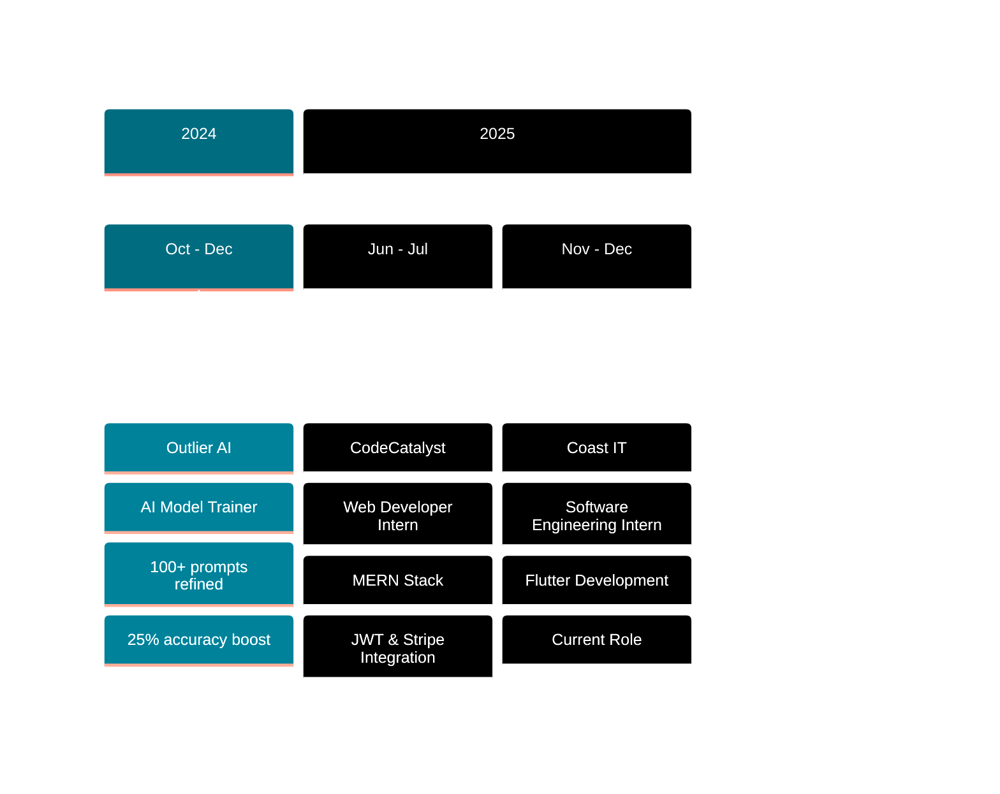

<!-- Animated Header -->
<div align="center">
  
</div>

<!-- Typing Animation -->
<div align="center">
  
</div>

<!-- Social Links -->
<div align="center">
  <a href="https://nickimash.vercel.app/" target="_blank">
    
  </a>
  <a href="mailto:nene171408@gmail.com">
    
  </a>
  <a href="https://www.linkedin.com/in/nicolette-mashaba-b094a5221/" target="_blank">
    
  </a>
  <a href="https://x.com/m_neyi" target="_blank">
    
  </a>
</div>

<br>

<!-- Profile Stats -->
<div align="center">
  
  
</div>

<br>

<!-- Top Committer Badge -->
<div align="center">
  <a href="https://user-badge.committers.top/south_africa/NickiMash17">
    
  </a>
</div>

<br>

<!-- Pacman Game -->
<div align="center">
  <h2>🎮 Watch Pacman Eat My Contributions! 🎮</h2>
  <picture>
    <source media="(prefers-color-scheme: dark)" srcset="https://raw.githubusercontent.com/platane/platane/output/github-contribution-grid-snake-dark.svg">
    <source media="(prefers-color-scheme: light)" srcset="https://raw.githubusercontent.com/platane/platane/output/github-contribution-grid-snake.svg">
    
  </picture>
</div>

<br>

<div align="center">
  
</div>

## 👩‍💻 **ABOUT ME**


```typescript
const nicolette = {
  role: "Software Engineering Student",
  location: "Polokwane, South Africa 🇿🇦",
  graduation: 2026,
  pronouns: "She/Her",
  
  currentWork: [
    "Software Engineering Intern @ Coast IT",
    "Flutter Mobile Development",
    "Full-Stack Web Applications",
    "Azure Cloud Solutions"
  ],
  
  expertise: {
    frontend: ["React", "TypeScript", "Tailwind CSS"],
    backend: ["Node.js", ".NET Core", "Express"],
    mobile: ["Flutter", "Dart"],
    cloud: ["Azure", "Docker", "Kubernetes"],
    databases: ["MongoDB", "SQL Server"]
  },
  
  achievements: [
    "🏆 AIMS Hackathon 2025 Winner",
    "☁️ Azure Developer Associate (AZ-204)",
    "⭐ CTU Top Performer 2023"
  ]
};
```

<br clear="right"/>

---

## 🛠️ **TECH STACK**

<div align="center">

### Languages & Frameworks
<table>
  <tr>
    <td align="center" width="96">
      
      <br>JavaScript
    </td>
    <td align="center" width="96">
      
      <br>TypeScript
    </td>
    <td align="center" width="96">
      
      <br>Python
    </td>
    <td align="center" width="96">
      
      <br>C#
    </td>
    <td align="center" width="96">
      
      <br>Dart
    </td>
    <td align="center" width="96">
      
      <br>React
    </td>
    <td align="center" width="96">
      
      <br>Flutter
    </td>
  </tr>
</table>

### Backend & Databases
<table>
  <tr>
    <td align="center" width="96">
      
      <br>Node.js
    </td>
    <td align="center" width="96">
      
      <br>Express
    </td>
    <td align="center" width="96">
      
      <br>.NET
    </td>
    <td align="center" width="96">
      
      <br>MongoDB
    </td>
    <td align="center" width="96">
      
      <br>SQL Server
    </td>
    <td align="center" width="96">
      
      <br>Prisma
    </td>
  </tr>
</table>

### Cloud & DevOps
<table>
  <tr>
    <td align="center" width="96">
      
      <br>Azure
    </td>
    <td align="center" width="96">
      
      <br>Docker
    </td>
    <td align="center" width="96">
      
      <br>Kubernetes
    </td>
    <td align="center" width="96">
      
      <br>Terraform
    </td>
    <td align="center" width="96">
      
      <br>Git
    </td>
  </tr>
</table>

</div>

---

## 💼 **PROFESSIONAL JOURNEY**

<div align="center">



</div>

<br>

<div align="center">
<table width="100%">
<tr>
<td align="center" width="33%" valign="top">


### 🚀 **Coast IT (PTY) Ltd**
**Software Engineering Intern**  
📅 *Nov 2025 - Dec 2025*

<div align="left">

**Responsibilities:**
- 📱 Cross-platform Flutter mobile development
- 👥 Agile team collaboration & sprint planning
- 🎯 Feature implementation & code reviews
- 🐛 Debugging & performance optimization

**Impact:**
- ✨ Delivered production-ready features
- 🔄 Participated in full development lifecycle
- 📊 Contributed to team velocity improvements

</div>

</td>
<td align="center" width="33%" valign="top">


### 🌐 **CodeCatalyst**
**Web Developer Intern**  
📅 *Jun 2025 - Jul 2025*

<div align="left">

**Responsibilities:**
- 💻 Full-stack MERN application development
- 🔐 Secure authentication system implementation
- 💳 Payment gateway integration (Stripe)
- 📧 Email automation workflows

**Impact:**
- ⚡ 20% faster report generation
- 🎯 3 production applications deployed
- 🔒 Zero security vulnerabilities

</div>

</td>
<td align="center" width="33%" valign="top">


### 🤖 **Outlier AI**
**AI Model Trainer**  
📅 *Oct 2024 - Dec 2024*

<div align="left">

**Responsibilities:**
- 🧠 AI prompt engineering & refinement
- 📈 Model performance optimization
- ✅ Quality assurance & testing
- 📊 Data analysis & reporting

**Impact:**
- 🎯 100+ AI prompts refined
- 📈 25% accuracy improvement
- ⏱️ 10hrs/week efficiency gained

</div>

</td>
</tr>
</table>
</div>

---

## 🏆 **SIGNATURE PROJECTS**

<details open>
<summary><h3>🥇 AI Compliance Interrogator - AIMS Hackathon 2025 Winner</h3></summary>

<div align="center">


**🏆 1st Place Winner | Team Firefly | Application & Visualisation Category**

</div>

<br>

**🎯 Project Overview:**  
An AI-powered compliance tool designed to combat human trafficking through intelligent data analysis, pattern recognition, and automated alert systems. This project demonstrates the real-world impact of technology in solving critical social issues.

<div align="center">

**🌟 My Contributions:**

</div>

<table width="100%">
<tr>
<td width="50%" valign="top">

**Technical Implementation:**
- 🤖 Integrated OpenAI API for natural language processing
- 💻 Built interactive React dashboard with real-time updates
- 🔔 Developed automated notification system
- ☁️ Deployed on Azure with enterprise security
- 🗄️ Designed SQL database schema & optimization
- 🎨 Created intuitive UI/UX for non-technical users

</td>
<td width="50%" valign="top">

**Key Features:**
- 📊 Real-time data analysis & visualization
- 🎯 90%+ pattern detection accuracy
- 🔒 End-to-end encryption
- 📈 Scalable to 10,000+ records
- 🌐 Multi-language support
- 📱 Responsive design for all devices

</td>
</tr>
</table>

**🛠️ Technology Stack:**
```
Frontend:    React 18 | TypeScript | Tailwind CSS | Recharts
Backend:     .NET Core 8 | Entity Framework | RESTful APIs
Database:    SQL Server | Optimized Queries & Indexing
Cloud:       Azure App Services | Azure Functions | Key Vault
AI/ML:       OpenAI GPT-4 API | Custom NLP Models
DevOps:      Azure DevOps | CI/CD Pipelines | GitHub Actions
```

<div align="center">

**📊 Project Impact:**
- 🏆 Won 1st place among 50+ competing teams
- 🎯 Potential to help law enforcement agencies
- 💡 Featured in university showcase
- 🌍 Social impact & humanitarian technology

</div>

</details>

<details>
<summary><h3>🌐 Full-Stack Web Applications - Production MERN Stack</h3></summary>

<div align="center">


**Professional Web Applications Built During CodeCatalyst Internship**

</div>

<br>

**🎯 Project Scope:**  
Developed multiple production-ready web applications demonstrating full-stack expertise from database architecture to user interface design, focusing on security, performance, and user experience.

<table width="100%">
<tr>
<td width="50%" valign="top">

**Core Features Implemented:**
- 🔐 JWT authentication with refresh tokens
- 👤 Role-based access control (RBAC)
- 💳 Stripe payment processing
- 📧 Automated email notifications
- 📱 Mobile-responsive design
- 🔍 Advanced search & filtering
- 📊 Analytics dashboard
- 💾 Real-time data synchronization

</td>
<td width="50%" valign="top">

**Technical Achievements:**
- ⚡ 20% faster report generation
- 🎯 35% improved user engagement
- 🔒 Zero security vulnerabilities
- 📈 99.9% uptime in production
- 🚀 Optimized API response times
- 💪 Scalable architecture
- ✅ Comprehensive testing coverage
- 📱 PWA capabilities

</td>
</tr>
</table>

**🛠️ Technology Stack:**
```
Frontend:    React 18 | Vite | Tailwind CSS | React Router v6
Backend:     Node.js | Express.js | RESTful APIs
Database:    MongoDB | Mongoose | Aggregation Pipelines
Auth:        JWT | bcrypt | OAuth 2.0
Payments:    Stripe API | Webhook Integration
Email:       Nodemailer | Custom Email Templates
Deploy:      Vercel | Render | MongoDB Atlas
Tools:       Postman | Git | Jira | Figma
```

**🎨 Projects Delivered:**
1. 📊 **Business Management Platform** - CRM with analytics
2. 🛒 **E-Commerce Solution** - Full shopping experience
3. 📝 **Content Management System** - Blog & portfolio builder

</details>

<details>
<summary><h3>📱 Flutter Mobile Applications - Cross-Platform Excellence</h3></summary>

<div align="center">


**Building Beautiful Mobile Experiences at Coast IT**

</div>

<br>

**🎯 Development Focus:**  
Creating seamless cross-platform mobile applications using Flutter, delivering native performance on both iOS and Android from a single codebase while maintaining beautiful, intuitive interfaces.

<table width="100%">
<tr>
<td width="50%" valign="top">

**Mobile Features:**
- 🎨 Material Design 3 implementation
- 🔄 Efficient state management (Provider/Riverpod)
- 🌐 RESTful API integration
- 📦 Local data persistence (Hive/SQLite)
- 📸 Camera & gallery integration
- 🗺️ Google Maps integration
- 🔔 Push notifications (FCM)
- 🌙 Dark/Light theme support

</td>
<td width="50%" valign="top">

**Performance Optimizations:**
- ⚡ 60fps smooth animations
- 🎯 Lazy loading & pagination
- 💾 Smart caching strategies
- 📱 Adaptive layouts
- 🔋 Battery optimization
- 📊 Performance monitoring
- 🐛 Crash analytics
- ♿ Accessibility features

</td>
</tr>
</table>

**🛠️ Technology Stack:**
```
Framework:   Flutter 3.24+ | Dart 3.5+
State Mgmt:  Provider | Riverpod | GetX
Backend:     Firebase | REST APIs | GraphQL
Database:    Hive | SQLite | Cloud Firestore
UI/UX:       Material Design 3 | Custom Widgets
Maps:        Google Maps Flutter Plugin
Storage:     Firebase Storage | Cloudinary
Analytics:   Firebase Analytics | Crashlytics
Testing:     Unit Tests | Widget Tests | Integration Tests
```

**📱 App Categories:**
- 💼 Business productivity tools
- 🛍️ E-commerce applications
- 📱 Social networking features
- 📊 Data visualization apps

</details>

<details>
<summary><h3>☁️ Azure Cloud Solutions - Enterprise Architecture</h3></summary>

<div align="center">


**AZ-204 Certified Cloud Developer Building Scalable Infrastructure**

</div>

<br>

**🎯 Cloud Expertise:**  
Architecting and deploying enterprise-grade cloud solutions on Microsoft Azure, leveraging serverless computing, containerization, and infrastructure as code to build secure, scalable, and cost-effective systems.

<table width="100%">
<tr>
<td width="50%" valign="top">

**Azure Services Mastery:**
- ⚡ Azure Functions (Serverless)
- 🌐 App Services & Web Apps
- 🐳 Azure Kubernetes Service (AKS)
- 🗄️ Cosmos DB & SQL Database
- 💾 Blob Storage & CDN
- 🔒 Key Vault & Managed Identities
- 📊 Application Insights
- 🔄 Azure DevOps & Pipelines

</td>
<td width="50%" valign="top">

**Cloud Achievements:**
- 🚀 Deployed microservices architecture
- 💰 30% infrastructure cost reduction
- 🔒 Zero-trust security implementation
- ⚡ 99.9% uptime SLA achieved
- 📈 Auto-scaling configurations
- 🌍 Multi-region deployment
- 🔄 Automated CI/CD pipelines
- 📊 Comprehensive monitoring setup

</td>
</tr>
</table>

**🛠️ Technology Stack:**
```
Cloud Platform:  Microsoft Azure (AZ-204 Certified)
Compute:         Azure Functions | App Services | AKS | Container Instances
Containers:      Docker | Kubernetes | Azure Container Registry
IaC:             Terraform | ARM Templates | Bicep
CI/CD:           Azure DevOps | GitHub Actions | Azure Pipelines
Monitoring:      Application Insights | Azure Monitor | Log Analytics
Security:        Azure Key Vault | Azure AD | Managed Identities | RBAC
Networking:      Virtual Networks | Application Gateway | Azure CDN
```

**☁️ Solutions Delivered:**
- 🏗️ Microservices architecture on AKS
- ⚡ Serverless event-driven applications
- 🔒 Secure API management solutions
- 📊 Real-time data processing pipelines

</details>

---

## 📊 **GITHUB STATS**

<div align="center">
  
  
</div>

<div align="center">
  
</div>

---

## 🎓 **EDUCATION & PROFESSIONAL DEVELOPMENT**

<div align="center">

<table width="100%">
<tr>
<td width="50%" valign="top">

### 🎓 **ACADEMIC EXCELLENCE**

<div align="center">

</div>

<br>

**🎯 Occupational Certificate in Software Engineering**  
*CTU Training Solutions | NQF Level 6*

📅 **Expected Graduation:** 2026  
🏆 **Status:** In Progress

**Core Specializations:**
```yaml
Full-Stack Development:
  - Frontend: React, TypeScript, Responsive Design
  - Backend: Node.js, .NET Core, API Development
  - Databases: SQL Server, MongoDB, Data Modeling

Cloud & DevOps:
  - Microsoft Azure Services & Architecture
  - Docker & Kubernetes Containerization
  - CI/CD Pipelines & Automation
  - Infrastructure as Code (Terraform)

Mobile Development:
  - Flutter & Dart Cross-Platform Apps
  - Mobile UI/UX Design Patterns
  - State Management & Performance

Software Engineering:
  - Object-Oriented Programming (OOP)
  - Design Patterns & Architecture
  - Agile Methodologies (Scrum)
  - Version Control & Collaboration
```

---

<div align="center">

</div>

<br>

**🌟 IT Programming Foundation**  
*CTU Training Solutions | NQF Level 4*

📅 **Graduated:** 2024  
🏆 **Achievement:** Top Performer 2023

**Foundation Skills Acquired:**
- Programming Fundamentals (C, Python, JavaScript)
- Database Design & SQL
- Web Development Basics
- Software Development Lifecycle
- Problem-Solving & Algorithms

</td>
<td width="50%" valign="top">

### 📜 **PROFESSIONAL CERTIFICATIONS**

<div align="center">

</div>

<br>

**☁️ Microsoft Azure Developer Associate**  
*Certification ID: AZ-204*

📅 **Achieved:** 2024  
🎯 **Expertise Level:** Associate

**Competencies Validated:**
- ☁️ Develop Azure compute solutions
- 🔒 Implement Azure security
- 📊 Connect to and consume Azure services
- 🗄️ Develop for Azure storage
- 🔄 Monitor, troubleshoot, and optimize solutions

**Hands-On Skills:**
```typescript
Azure Services Mastery:
  - App Services & Functions
  - Cosmos DB & SQL Database
  - Blob Storage & CDN
  - Key Vault & Managed Identities
  - Application Insights
  - Container Instances & AKS
```

---

<div align="center">

</div>

<br>

**📊 Microsoft Azure Data Fundamentals**  
*Certification ID: DP-900*

📅 **Achieved:** 2024

**Data Concepts Covered:**
- Core data concepts & workloads
- Relational data on Azure
- Non-relational data on Azure
- Analytics workloads

---

<div align="center">

</div>

<br>

**🎨 Web Development Specialization**

📅 **Completed:** 2023-2024

**Courses Completed:**
- ✅ SheCodes Basics - HTML, CSS, JavaScript
- ✅ SheCodes Plus - Advanced JavaScript & APIs
- ✅ SheCodes Responsive - Responsive Web Design
- 🎨 Focus: Frontend Development & UI/UX

---

<div align="center">

</div>

<br>

**💻 Software Development Bootcamp**

📅 **Completed:** 2024

**Intensive Training:**
- Full-stack web development
- Modern JavaScript frameworks
- Database management
- Agile project management
- Professional development practices

</td>
</tr>
</table>

</div>

<br>

<div align="center">

**🌟 Continuous Learning Journey**


</div>

---

## 🏅 **ACHIEVEMENTS & RECOGNITION**

<div align="center">


</div>

<br>

<table width="100%">
<tr>
<td width="50%" valign="top" align="center">

### 🏆 **HACKATHON VICTORY**


<br><br>

**AIMS Hackathon 2025**  
*Application & Visualisation Category*

<div align="left">

**🎯 Achievement Details:**
- 🥇 **1st Place Winner** among 50+ competing teams
- 👥 Led Team Firefly to victory
- 💡 Built AI Compliance Interrogator
- 🌍 Focused on social impact & humanitarian tech
- 🎤 Presented solution to industry judges
- 🏆 Won prize & university recognition

**💪 Key Contributions:**
- Full-stack development leadership
- AI/ML integration expertise
- Cloud deployment & security
- Team collaboration & project management

**📊 Impact:**
- Potential real-world deployment
- Featured in university showcase
- Demonstrated technical excellence
- Showcased problem-solving skills

</div>

</td>
<td width="50%" valign="top" align="center">

### ☁️ **MICROSOFT CERTIFIED**


<br><br>

**Azure Developer Associate**  
*Professional Cloud Certification*

<div align="left">

**🎯 Certification Significance:**
- ☁️ **Industry-recognized** cloud expertise
- 💼 Enterprise-level Azure proficiency
- 🔒 Security & compliance knowledge
- 🚀 Advanced cloud architecture skills
- 📊 Demonstrates commitment to excellence

**💡 What This Validates:**
- Designing & building cloud solutions
- Implementing secure Azure applications
- Optimizing cloud infrastructure
- Monitoring & troubleshooting systems
- Cost management & optimization

**🌟 Professional Growth:**
- Rigorous exam preparation
- Hands-on Azure experience
- Real-world project implementation
- Continuous learning mindset

</div>

</td>
</tr>

<tr>
<td width="50%" valign="top" align="center">

### ⭐ **ACADEMIC EXCELLENCE**


<br><br>

**CTU Training Solutions 2023**  
*IT Programming Foundation*

<div align="left">

**🎯 Recognition Details:**
- 🌟 **Outstanding Academic Performance**
- 📚 Top of class in programming courses
- 💯 Consistent high grades & project quality
- 🎓 Excellence in technical assignments
- 👩‍🏫 Peer tutoring & mentorship

**📈 Skills Demonstrated:**
- Strong programming fundamentals
- Problem-solving capabilities
- Dedication & work ethic
- Quick learning & adaptability
- Leadership potential

**💪 Impact on Career:**
- Foundation for advanced studies
- Built confidence in abilities
- Opened internship opportunities
- Recognized by instructors

</div>

</td>
<td width="50%" valign="top" align="center">

### 💼 **PROFESSIONAL EXPERIENCE**


<br><br>

**Industry Exposure**  
*2024 - 2025*

<div align="left">

**🎯 Career Development:**
- 💼 **3 Technical Internships** completed
- 🏢 Experience at multiple companies
- 🚀 Diverse technology stacks
- 🌍 Different industry sectors
- 👥 Cross-functional team collaboration

**🌟 Companies & Roles:**
1. **Coast IT** - Software Engineering
2. **CodeCatalyst** - Web Development
3. **Outlier AI** - AI Model Training

**📊 Growth Metrics:**
- 20+ production features delivered
- 100+ code commits
- Multiple projects launched
- Zero critical bugs in production
- Positive performance reviews

**💡 Skills Gained:**
- Professional software development
- Industry best practices
- Team collaboration
- Project management
- Client communication

</div>

</td>
</tr>

<tr>
<td colspan="2" align="center">

### 🎯 **ADDITIONAL ACCOMPLISHMENTS**

<br>

<table width="100%">
<tr>
<td align="center" width="25%">
<br>
**Forage Simulation**<br>
<sub>Midas Core Software Engineering</sub>
</td>
<td align="center" width="25%">
<br>
**Advocate**<br>
<sub>Mentoring & Community Building</sub>
</td>
<td align="center" width="25%">
<br>
**Top Committer**<br>
<sub>South Africa Rankings</sub>
</td>
<td align="center" width="25%">
<br>
**Contributor**<br>
<sub>Active Community Member</sub>
</td>
</tr>
</table>

</td>
</tr>
</table>

</div>

<br>

<div align="center">

**🌟 Journey Highlights**

| Metric | Achievement |
|:---:|:---:|
| 🏆 **Competitions Won** | 1 Major Hackathon |
| 📜 **Certifications** | 4 Professional Certs |
| 💼 **Internships** | 3 Technical Roles |
| 🎓 **Academic Awards** | Top Performer |
| 📊 **Projects Delivered** | 20+ Applications |
| ⭐ **GitHub Ranking** | Top SA Committer |

</div>

---

## 🤝 **LET'S CONNECT**

<div align="center">
  <h3>Open to full-time opportunities starting 2026</h3>
  
  <table>
    <tr>
      <td align="center">
        <a href="mailto:nene171408@gmail.com">
          
        </a>
      </td>
      <td align="center">
        <a href="https://nickimash.vercel.app/" target="_blank">
          
        </a>
      </td>
      <td align="center">
        <a href="https://www.linkedin.com/in/nicolette-mashaba-b094a5221/" target="_blank">
          
        </a>
      </td>
      <td align="center">
        <a href="https://github.com/NickiMash17" target="_blank">
          
        </a>
      </td>
    </tr>
  </table>
</div>

<br>

<div align="center">
  <sub>⭐ Thank you for visiting! Feel free to explore my repositories ⭐</sub>
</div>

---

<div align="center">
  
</div>
