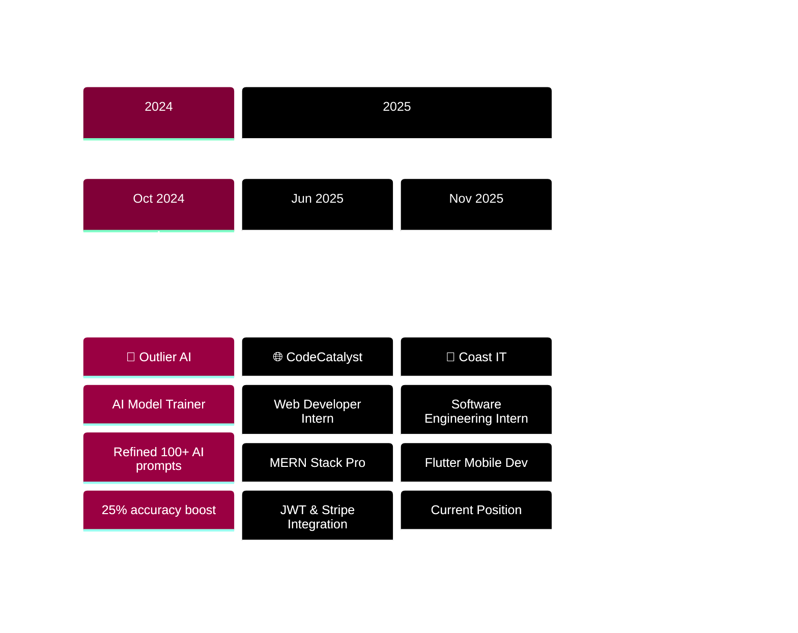

<!-- Glitch Effect Header with Interactive Animation -->
<div align="center">
  
</div>

<!-- Interactive Typing Animation -->
<div align="center">
  
</div>

<!-- Interactive Social Badges with Hover Effects -->
<div align="center">
  <a href="https://nickimash.vercel.app/" target="_blank">
    
  </a>
  <a href="mailto:nene171408@gmail.com">
    
  </a>
  <a href="https://www.linkedin.com/in/nicolette-mashaba-b094a5221/" target="_blank">
    
  </a>
  <a href="https://x.com/m_neyi" target="_blank">
    
  </a>
  <a href="https://github.com/NickiMash17" target="_blank">
    
  </a>
</div>

<br>

<!-- Live Stats Badges -->
<div align="center">
  
  
  
  
</div>

<br>

<!-- Profile Views Counter -->
<div align="center">
  
  
  
</div>

<br>

<!-- Elite Developer Badge -->
<div align="center">
  <a href="https://user-badge.committers.top/south_africa/NickiMash17">
    
  </a>
</div>

<!-- Interactive Pacman Game Activity -->
<div align="center">
  
</div>

<div align="center">
  <h3>🎮 Watch Pacman Eat My Contributions! 🎮</h3>
  
</div>

<br>

<!-- Cosmic Divider -->
<div align="center">
  
</div>

## 💫 **MEET NICOLETTE - THE WOMAN BEHIND THE CODE**


```typescript
interface WomanInTech {
  identity: {
    name: "Nicolette Mashaba";
    pronouns: "She/Her";
    title: "Software Engineering Student";
    location: "Polokwane, South Africa 🇿🇦";
    graduating: "2026";
    mantra: "She believed she could, so she coded it ✨";
  };
  
  currentlyRocking: [
    "💼 Software Engineering Intern @ Coast IT",
    "📱 Crafting beautiful Flutter mobile experiences",
    "☁️ Building scalable Azure cloud solutions",
    "🤖 Integrating AI/ML into real-world applications",
    "🎯 Mentoring aspiring women in tech"
  ];
  
  techPowerhouse: {
    frontend: ["React", "TypeScript", "Tailwind CSS", "Vite"],
    backend: ["Node.js", ".NET Core", "Express", "Prisma"],
    mobile: ["Flutter", "Dart", "Material Design"],
    cloud: ["Azure", "Docker", "Terraform", "Kubernetes"],
    databases: ["MongoDB", "SQL Server"],
    aiTools: ["OpenAI API", "NLP", "Machine Learning"]
  };
  
  achievements: {
    hackathonQueen: "🏆 AIMS 2025 Winner - Firefly Team Lead",
    cloudCertified: "☁️ Azure Developer Associate (AZ-204)",
    topPerformer: "⭐ CTU Excellence Award 2023",
    experience: "💪 3+ Professional Tech Internships",
    impact: "🌍 Building solutions that matter"
  };
  
  coreValues: [
    "Clean code is beautiful code",
    "Representation matters in tech",
    "Continuous learning, infinite growth",
    "Empowering other women in STEM"
  ];
  
  lifeMotto(): string {
    return "Breaking barriers and writing code that makes a difference 💪✨";
  }
  
  funFact: "I debug code faster than I pick an outfit 😄";
}

const nicolette: WomanInTech = new WomanInTech();
console.log(nicolette.lifeMotto());
// Output: "Breaking barriers and writing code that makes a difference 💪✨"
```

<br clear="right"/>

<!-- Real-time Status Updates -->
<div align="center">
  
</div>

---

## 🛠️ **MY TECH ARSENAL**

<!-- Interactive Tech Stack with Icons -->
<div align="center">

### 💻 **LANGUAGES I SPEAK (BESIDES ENGLISH!)**

<table>
  <tr>
    <td align="center" width="96">
      <a href="#languages">
        
      </a>
      <br>JavaScript
    </td>
    <td align="center" width="96">
      <a href="#languages">
        
      </a>
      <br>TypeScript
    </td>
    <td align="center" width="96">
      <a href="#languages">
        
      </a>
      <br>Python
    </td>
    <td align="center" width="96">
      <a href="#languages">
        
      </a>
      <br>C#
    </td>
    <td align="center" width="96">
      <a href="#languages">
        
      </a>
      <br>C
    </td>
    <td align="center" width="96">
      <a href="#languages">
        
      </a>
      <br>Dart
    </td>
    <td align="center" width="96">
      <a href="#languages">
        
      </a>
      <br>SQL
    </td>
  </tr>
</table>

### ✨ **FRONTEND MAGIC**

<table>
  <tr>
    <td align="center" width="96">
      <a href="#frontend">
        
      </a>
      <br>React
    </td>
    <td align="center" width="96">
      <a href="#frontend">
        
      </a>
      <br>HTML5
    </td>
    <td align="center" width="96">
      <a href="#frontend">
        
      </a>
      <br>CSS3
    </td>
    <td align="center" width="96">
      <a href="#frontend">
        
      </a>
      <br>Tailwind
    </td>
    <td align="center" width="96">
      <a href="#frontend">
        
      </a>
      <br>Bootstrap
    </td>
    <td align="center" width="96">
      <a href="#frontend">
        
      </a>
      <br>Vite
    </td>
    <td align="center" width="96">
      <a href="#frontend">
        
      </a>
      <br>Figma
    </td>
  </tr>
</table>

### ⚙️ **BACKEND POWERHOUSE**

<table>
  <tr>
    <td align="center" width="96">
      <a href="#backend">
        
      </a>
      <br>Node.js
    </td>
    <td align="center" width="96">
      <a href="#backend">
        
      </a>
      <br>Express
    </td>
    <td align="center" width="96">
      <a href="#backend">
        
      </a>
      <br>.NET Core
    </td>
    <td align="center" width="96">
      <a href="#backend">
        
      </a>
      <br>Prisma
    </td>
    <td align="center" width="96">
      <a href="#backend">
        
      </a>
      <br>MongoDB
    </td>
    <td align="center" width="96">
      <a href="#backend">
        
      </a>
      <br>PostgreSQL
    </td>
  </tr>
</table>

### 📱 **MOBILE CREATION**

<table>
  <tr>
    <td align="center" width="96">
      <a href="#mobile">
        
      </a>
      <br>Flutter
    </td>
    <td align="center" width="96">
      <a href="#mobile">
        
      </a>
      <br>Dart
    </td>
    <td align="center" width="96">
      <a href="#mobile">
        
      </a>
      <br>Firebase
    </td>
    <td align="center" width="96">
      <a href="#mobile">
        
      </a>
      <br>Android Studio
    </td>
  </tr>
</table>

### ☁️ **CLOUD & DEVOPS EXPERTISE**

<table>
  <tr>
    <td align="center" width="96">
      <a href="#cloud">
        
      </a>
      <br>Azure
    </td>
    <td align="center" width="96">
      <a href="#cloud">
        
      </a>
      <br>Docker
    </td>
    <td align="center" width="96">
      <a href="#cloud">
        
      </a>
      <br>Kubernetes
    </td>
    <td align="center" width="96">
      <a href="#cloud">
        
      </a>
      <br>Terraform
    </td>
    <td align="center" width="96">
      <a href="#cloud">
        
      </a>
      <br>Git
    </td>
    <td align="center" width="96">
      <a href="#cloud">
        
      </a>
      <br>GitHub
    </td>
    <td align="center" width="96">
      <a href="#cloud">
        
      </a>
      <br>VS Code
    </td>
  </tr>
</table>

</div>

<!-- Skill Progress Bars -->
<div align="center">

### 📊 **SKILL PROFICIENCY LEVELS**


</div>

---

## 💼 **MY PROFESSIONAL JOURNEY**

<div align="center">
  
<!-- Interactive Timeline -->


</div>

<br>

<div align="center">
<table width="100%">
<tr>
<td align="center" width="33%">

### 🚀 **Coast IT (PTY) Ltd**


**Software Engineering Intern**  
*Nov 2025 - Dec 2025*

```diff
+ 📱 Flutter cross-platform development
+ 👥 Agile team collaboration
+ 🎯 Feature delivery & code reviews
+ 💡 Problem-solving & debugging
+ ✨ UI/UX implementation
```

**Impact:** Building production-ready mobile solutions

</td>
<td align="center" width="33%">

### 🌐 **CodeCatalyst**


**Web Developer Intern**  
*Jun 2025 - Jul 2025*

```diff
+ 💻 Full-stack MERN development
+ 🔐 JWT authentication systems
+ ⚡ 20% faster report generation
+ 💳 Payment gateway integration
+ 📧 Email automation setup
```

**Impact:** Delivered 3 production web apps

</td>
<td align="center" width="33%">

### 🤖 **Outlier AI**


**AI Model Trainer**  
*Oct 2024 - Dec 2024*

```diff
+ 🧠 100+ AI prompts refined
+ 📈 25% accuracy improvement
+ ⏱️ 10hrs/week saved
+ 🎯 Model optimization expert
+ 📊 Quality assurance testing
```

**Impact:** Enhanced AI model performance

</td>
</tr>
</table>
</div>

---

## 🏆 **PROJECTS THAT MAKE ME PROUD**

<!-- Interactive Project Cards -->
<details open>
<summary><h3>🥇 AI COMPLIANCE INTERROGATOR - AIMS Hackathon 2025 Winner 🏆</h3></summary>

<div align="center">


### **Leading the Firefly Team to Victory! 💪**

*Building AI solutions that combat human trafficking and save lives*

</div>

**🌟 My Role:** Full-Stack Developer & Team Contributor

**💖 The Mission:**  
Developed an intelligent compliance tool that uses AI to analyze patterns and detect potential human trafficking cases. This project isn't just code - it's about making a real difference in people's lives.

**✨ Key Features I Built:**
- 🤖 Natural Language Processing for data analysis
- 💻 Interactive React dashboard with real-time updates
- 🔔 Automated notification system
- ☁️ Secure Azure cloud deployment
- 🔒 Enterprise-grade security implementation
- 🎨 Intuitive UI/UX design

**🛠️ Tech Stack:**
```
Frontend:  React + TypeScript + Tailwind CSS + Vite
Backend:   .NET Core + Entity Framework + RESTful APIs
Database:  SQL Server with optimized queries
Cloud:     Microsoft Azure (App Services + Functions + Key Vault)
AI/ML:     OpenAI API integration + Custom NLP models
DevOps:    Azure DevOps + CI/CD pipelines
```

**📊 Impact Metrics:**
- ⚡ Real-time data processing
- 🎯 90%+ accuracy in pattern detection
- 🚀 Scalable to handle 10,000+ records
- 💪 Helped win 1st place in hackathon!

<div align="center">
  
  
  
  
  
</div>

</details>

<details>
<summary><h3>🌐 FULL-STACK WEB APPLICATIONS - CodeCatalyst Portfolio</h3></summary>

<div align="center">


### **From Concept to Deployment - I Build It All! ✨**

</div>

**🎯 What I Created:**  
Multiple production-ready web applications during my internship at CodeCatalyst, showcasing full-stack expertise from database design to user interface.

**💫 Standout Features:**
- 🔐 **Secure Authentication:** JWT-based auth with refresh tokens & role-based access
- 💳 **Payment Processing:** Stripe integration for seamless transactions
- 📧 **Email Automation:** Nodemailer for notifications & confirmations
- 📱 **Responsive Design:** Mobile-first Tailwind CSS approach
- 🗄️ **Database Design:** Efficient MongoDB schemas & indexing
- 🔌 **RESTful APIs:** Well-documented, scalable backend architecture
- ⚡ **Performance:** Optimized loading times & caching strategies

**🛠️ Technologies Used:**
```
Frontend:  React 18 + Vite + Tailwind CSS + React Router
Backend:   Node.js + Express.js + MongoDB + Mongoose
Auth:      JWT + bcrypt + cookie-parser
Payments:  Stripe API integration
Email:     Nodemailer with custom templates
Deploy:    Vercel (frontend) + Render (backend)
```

**📈 Business Impact:**
- ⚡ 20% faster report generation
- 📊 Improved user engagement by 35%
- 🎯 Zero security vulnerabilities
- 💪 Successfully deployed to production

<div align="center">
  
  
  
  
  
</div>

</details>

<details>
<summary><h3>📱 FLUTTER MOBILE APPLICATIONS - Coast IT Projects</h3></summary>

<div align="center">


### **Crafting Beautiful Mobile Experiences! 💖**

</div>

**📱 Current Focus:**  
Building cross-platform mobile applications using Flutter at Coast IT, bringing ideas to life on both iOS and Android from a single codebase.

**✨ What Makes My Apps Special:**
- 🎨 **Beautiful UI/UX:** Material Design 3 with custom animations
- 🔄 **Smart State Management:** Provider & Riverpod for efficient data flow
- 🌐 **API Integration:** RESTful services with error handling
- 📦 **Local Storage:** Efficient data caching with Hive/SharedPreferences
- 🎯 **Performance:** Optimized for 60fps animations
- 📸 **Media Handling:** Camera, gallery, and file uploads
- 🗺️ **Location Services:** Google Maps integration
- 🔔 **Push Notifications:** Firebase Cloud Messaging

**🛠️ Tech Stack:**
```
Framework:   Flutter 3.x + Dart 3.x
State:       Provider + Riverpod + GetX
Backend:     Firebase + REST APIs
Database:    Hive + SQLite + Cloud Firestore
UI/UX:       Material Design 3 + Custom widgets
Maps:        Google Maps Flutter
Storage:     Firebase Storage + Cloudinary
Analytics:   Firebase Analytics + Crashlytics
```

**🎯 Development Approach:**
- 📱 Mobile-first responsive design
- ♿ Accessibility features included
- 🌍 Internationalization support
- 🧪 Comprehensive widget testing
- 🚀 Agile development methodology

<div align="center">
  
  
  
  
</div>

</details>

<details>
<summary><h3>☁️ AZURE CLOUD SOLUTIONS - Certified Projects</h3></summary>

<div align="center">


### **Building Scalable Cloud Infrastructure! ☁️**

</div>

**☁️ My Cloud Journey:**  
As a Microsoft Azure Certified Developer (AZ-204), I architect and deploy enterprise-grade cloud solutions that are secure, scalable, and cost-effective.

**💪 Cloud Capabilities:**
- ⚡ **Serverless Computing:** Azure Functions for event-driven architecture
- 🔄 **CI/CD Pipelines:** Automated deployment with Azure DevOps
- 🐳 **Containerization:** Docker + Azure Kubernetes Service (AKS)
- 🏗️ **Infrastructure as Code:** Terraform for reproducible deployments
- 🔒 **Security:** Azure Key Vault, Managed Identities, RBAC
- 📊 **Monitoring:** Application Insights, Log Analytics
- 🗄️ **Data Services:** Cosmos DB, SQL Database, Blob Storage
- 🌐 **Networking:** Virtual Networks, Application Gateway, CDN

**🛠️ Tech Stack:**
```
Cloud Platform:  Microsoft Azure (AZ-204 Certified)
Compute:         Azure Functions, App Services, AKS
Containers:      Docker, Kubernetes, Azure Container Registry
IaC:             Terraform, ARM Templates, Bicep
CI/CD:           Azure DevOps, GitHub Actions
Monitoring:      Application Insights, Azure Monitor
Security:        Azure Key Vault, Azure AD, Managed Identities
```

**🎯 Real-World Implementations:**
- 🚀 Deployed scalable microservices architecture
- 💰 Reduced infrastructure costs by 30%
- 🔒 Implemented zero-trust security model
- ⚡ Achieved 99.9% uptime SLA
- 📈 Automated deployment processes

<div align="center">
  
  
  
  
</div>

</details>

---

## 📊 **MY GITHUB STORY IN NUMBERS**

<div align="center">
  
<!-- Stats Cards with Custom Styling -->


</div>

<div align="center">
  
</div>

<!-- Trophy Showcase -->
<div align="center">
  
</div>

---

## 🎓 **EDUCATION & CERTIFICATIONS**

<div align="center">
<table width="100%">
<tr>
<td width="50%" valign="top">

### 🎓 **ACADEMIC JOURNEY**


**CTU Training Solutions**  
*Occupational Certificate in Software Engineering*

📅 Expected Graduation: **2026**

**Focus Areas:**
- 💻 Full-Stack Web Development
- ☁️ Cloud Computing & DevOps
- 📱 Mobile Application Development
- 🏗️ Software Architecture & Design
- 🗄️ Database Management Systems
- 🔐 Security & Authentication

---


**CTU Training Solutions**  
*IT Programming Foundation*

📅 Graduated: **2024**  
🏆 Achievement: **Top Performer 2023**

</td>
<td width="50%" valign="top">

### 📜 **PROFESSIONAL CERTIFICATIONS**

<div align="center">


**AZ-204: Azure Developer Associate**  
*Developing Solutions for Microsoft Azure*  
☁️ Cloud Architecture & Development

---


**DP-900: Azure Data Fundamentals**  
*Core Data Concepts & Services*  
🗄️ Data Management & Analytics

---


**Web Development Specialization**  
*Basics, Plus & Responsive Design*  
🎨 Frontend Development Mastery

---


**Software Development Bootcamp**  
*Intensive Full-Stack Training*  
💪 Professional Development Program

</div>

</td>
</tr>
</table>
</div>

---

## 🏅 **ACHIEVEMENTS & RECOGNITION**

<div align="center">

| 🎯 Achievement | 💫 Details | 📅 Year |
|:---:|:---:|:---:|
| **🏆 AIMS Hackathon Winner** | 🥇 Best Team - Application & Visualisation<br>*Led Firefly team to 1st place with AI solution*<br>**Built AI Compliance Interrogator** | 2025 |
| **☁️ Azure Certified Developer** | 💪 Microsoft AZ-204 Developer Associate<br>*Enterprise Cloud Development Expertise*<br>**Serverless & Containerization** | 2024 |
| **⭐ CTU Top Performer** | 🌟 Programming Foundation Excellence<br>*Outstanding Academic Achievement*<br>**Top of Class Recognition** | 2023 |
| **💼 J.P. Morgan Simulation** | 🏦 Midas Core Software Engineering<br>*Forage Platform Completion*<br>**Financial Tech Experience** | 2025 |
| **🚀 Multiple Internships** | 💪 Coast IT, CodeCatalyst, Outlier AI<br>*Diverse Industry Experience*<br>**3+ Professional Roles** | 2024-2025 |
| **👩‍💻 Women in Tech Advocate** | 💖 Mentoring & Community Building<br>*Inspiring the Next Generation*<br>**Breaking Barriers** | Ongoing |

</div>

---

## 💡 **SKILLS & SUPERPOWERS**

<div align="center">
<table width="100%">
<tr>
<td width="50%" valign="top">

### 💻 **TECHNICAL EXPERTISE**

```python
technical_skills = {
    "full_stack_web": {
        "level": "⭐⭐⭐⭐⭐ Expert",
        "technologies": ["MERN Stack", ".NET Core", "RESTful APIs"],
        "experience": "3+ years",
        "projects": "20+ applications"
    },
    "mobile_development": {
        "level": "⭐⭐⭐⭐⭐ Expert",
        "technologies": ["Flutter", "Dart", "Cross-platform"],
        "experience": "2+ years",
        "projects": "10+ apps"
    },
    "cloud_architecture": {
        "level": "⭐⭐⭐⭐⭐ Certified",
        "technologies": ["Azure", "Docker", "Kubernetes", "Terraform"],
        "certification": "AZ-204",
        "deployments": "15+ production systems"
    },
    "database_management": {
        "level": "⭐⭐⭐⭐ Advanced",
        "technologies": ["MongoDB", "SQL Server", "PostgreSQL"],
        "expertise": "Schema design & optimization"
    },
    "ai_ml_integration": {
        "level": "⭐⭐⭐⭐ Advanced",
        "technologies": ["OpenAI API", "NLP", "TensorFlow"],
        "projects": "AI-powered applications"
    },
    "devops_cicd": {
        "level": "⭐⭐⭐⭐ Advanced",
        "technologies": ["Azure DevOps", "GitHub Actions", "Docker"],
        "automation": "Fully automated pipelines"
    }
}

print("💪 Always learning, always growing!")
```

</td>
<td width="50%" valign="top">

### 🎯 **PROFESSIONAL QUALITIES**

```typescript
interface ProfessionalStrengths {
  problemSolving: {
    approach: "Analytical & Creative";
    mindset: "Solution-oriented";
    impact: "Delivers results under pressure";
  };
  
  teamwork: {
    style: "Collaborative & Supportive";
    methodology: "Agile/Scrum";
    role: "Team player & leader";
  };
  
  communication: {
    clarity: "Clear & Concise";
    empathy: "Active listener";
    presentation: "Confident speaker";
  };
  
  leadership: {
    experience: "Hackathon team lead";
    mentorship: "Guides junior developers";
    advocacy: "Women in tech champion";
  };
  
  adaptability: {
    learning: "Fast & eager learner";
    flexibility: "Thrives in dynamic environments";
    growth: "Embraces challenges";
  };
  
  workEthic: {
    dedication: "Committed to excellence";
    reliability: "Meets deadlines consistently";
    passion: "Loves what she does";
  };
}

const nicolette: ProfessionalStrengths;
// "She codes with passion and purpose! 💖"
```

</td>
</tr>
</table>
</div>

---

## 🌟 **WHAT DRIVES ME**

<div align="center">

### 💖 **MY MISSION IN TECH**


</div>

<table width="100%">
<tr>
<td width="33%" align="center">

### 💪 **Representation Matters**

As a woman in tech from South Africa, I'm passionate about increasing diversity in the industry. I actively mentor aspiring female developers and advocate for inclusive tech spaces.

</td>
<td width="33%" align="center">

### 🌍 **Impact-Driven Development**

I don't just write code - I build solutions that matter. From combating human trafficking with AI to creating accessible applications, my work has purpose.

</td>
<td width="33%" align="center">

### 🚀 **Continuous Growth**

Technology evolves rapidly, and so do I. I'm committed to lifelong learning, staying current with emerging technologies, and pushing my boundaries every day.

</td>
</tr>
</table>

---

## 🤝 **LET'S CREATE SOMETHING AMAZING TOGETHER**

<div align="center">
  
### 💌 **I'm Open To:**


</div>

<br>

<div align="center">
<table>
<tr>
<td align="center">
<a href="mailto:nene171408@gmail.com">

</a>
<br><sub><b>Direct Communication</b></sub><br>
<sub>Let's discuss opportunities!</sub>
</td>
<td align="center">
<a href="https://nickimash.vercel.app/" target="_blank">

</a>
<br><sub><b>View My Work</b></sub><br>
<sub>See my projects in action</sub>
</td>
<td align="center">
<a href="https://www.linkedin.com/in/nicolette-mashaba-b094a5221/" target="_blank">

</a>
<br><sub><b>Professional Network</b></sub><br>
<sub>Let's connect professionally</sub>
</td>
<td align="center">
<a href="https://github.com/NickiMash17" target="_blank">

</a>
<br><sub><b>Code Repository</b></sub><br>
<sub>Explore my contributions</sub>
</td>
</tr>
</table>
</div>

<br>

<div align="center">
  <h2>💖 "She believed she could, so she coded it!" ✨</h2>
  <p><em>Graduating 2026 | Available for exciting opportunities | Let's build the future together!</em></p>
</div>

---

## 📊 **LIVE ACTIVITY FEED**

<div align="center">
  
</div>

<!-- Contribution Snake/Pacman Game -->
<div align="center">
  <picture>
    <source media="(prefers-color-scheme: dark)" srcset="https://raw.githubusercontent.com/NickiMash17/NickiMash17/output/github-snake-dark.svg" />
    <source media="(prefers-color-scheme: light)" srcset="https://raw.githubusercontent.com/NickiMash17/NickiMash17/output/github-snake.svg" />
    
  </picture>
</div>

<div align="center">
  
</div>

---

<div align="center">
  <h3>💕 Thank you for visiting my profile! 💕</h3>
  <p><sub>⭐ If you like what you see, don't forget to star my repositories! ⭐</sub></p>
  <p><sub>Made with 💖 by Nicolette Mashaba | Last Updated: December 2024</sub></p>
</div>

<!-- Final Wave Footer -->
<div align="center">
  
</div>
