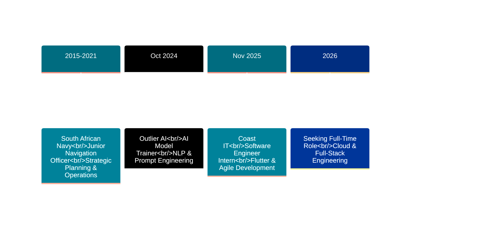

<!-- Animated Header -->
<div align="center">
  
</div>

<!-- Dynamic Typing Animation -->
<div align="center">
  
</div>

<!-- Enhanced Social Links -->
<div align="center">
  <a href="https://nicmash-porfolio.vercel.app/" target="_blank">
    
  </a>
  <a href="mailto:nene171408@gmail.com">
    
  </a>
  <a href="https://www.linkedin.com/in/nicolette-mashaba-b094a5221/" target="_blank">
    
  </a>
  <a href="https://x.com/m_neyi" target="_blank">
    
  </a>
  <a href="tel:+27631526795">
    
  </a>
</div>

<br>

<!-- Profile Analytics -->
<div align="center">
  
  
  
  
</div>

<br>

<!-- Committer Badge -->
<div align="center">
  <a href="https://user-badge.committers.top/south_africa/NickiMash17">
    
  </a>
</div>

<br>

<!-- GitHub Contribution Snake -->
<div align="center">
  <picture>
    <source media="(prefers-color-scheme: dark)" srcset="https://raw.githubusercontent.com/platane/platane/output/github-contribution-grid-snake-dark.svg">
    <source media="(prefers-color-scheme: light)" srcset="https://raw.githubusercontent.com/platane/platane/output/github-contribution-grid-snake.svg">
    
  </picture>
</div>

<br>

<!-- Elegant Separator -->


## 🚀 ABOUT ME


```typescript
const nicolette = {
  role: "Software Engineer & Cloud Developer",
  location: "Polokwane, South Africa 🇿🇦 (SAST)",
  graduation: "2026",
  pronouns: "She/Her",
  
  journey: {
    past: "Junior Navigation Officer, South African Navy (2015-2021)",
    present: "Software Engineering Graduate @ CTU",
    future: "Full-Stack Cloud Engineer"
  },
  
  currentFocus: [
    "🎯 AI-Powered Applications",
    "☁️ Cloud-Native Architecture", 
    "📱 Cross-Platform Mobile Development",
    "🤖 NLP & Machine Learning Integration"
  ],
  
  techStack: {
    frontend: ["React", "Next.js", "TypeScript", "Tailwind CSS"],
    backend: ["Node.js", ".NET Core", "FastAPI", "Express"],
    mobile: ["Flutter", "Dart", "BLoC Pattern"],
    cloud: ["Azure", "Firebase", "Docker", "Terraform"],
    ai: ["OpenAI API", "NLP", "Prompt Engineering"],
    databases: ["MongoDB", "SQL Server", "PostgreSQL", "Firestore"]
  },
  
  achievements: [
    "🏆 AIMS Hackathon 2025 Winner",
    "☁️ Microsoft Azure Developer Associate (AZ-204)",
    "📊 Azure Data Fundamentals (DP-900)",
    "⭐ CTU Top Performer 2023",
    "🎖️ Former Naval Officer (Strategic Planning & Leadership)"
  ],
  
  impact: {
    aiAccuracy: "+25%",
    timeSaved: "10+ hours/week",
    fuelEfficiency: "-10% in naval operations",
    testCoverage: "80%+"
  }
};
```

### 💡 Unique Value Proposition

My background combines **military precision** with **innovative tech solutions**. As a former Junior Navigation Officer in the South African Navy, I developed strategic planning and optimization skills—achieving 10% fuel efficiency improvements and 15% reduction in operational downtime. Now, I apply that same analytical rigor to building scalable cloud applications and AI-powered platforms that solve real-world problems.

<br clear="right"/>

---

## 🛠️ TECHNOLOGY ARSENAL

<div align="center">

### 💻 Core Languages & Frameworks
<table>
  <tr>
    <td align="center" width="100">
      
      <br><b>JavaScript</b>
    </td>
    <td align="center" width="100">
      
      <br><b>TypeScript</b>
    </td>
    <td align="center" width="100">
      
      <br><b>Python</b>
    </td>
    <td align="center" width="100">
      
      <br><b>C#</b>
    </td>
    <td align="center" width="100">
      
      <br><b>Dart</b>
    </td>
    <td align="center" width="100">
      
      <br><b>React</b>
    </td>
    <td align="center" width="100">
      
      <br><b>Next.js</b>
    </td>
    <td align="center" width="100">
      
      <br><b>Flutter</b>
    </td>
  </tr>
</table>

### ⚙️ Backend & Data Infrastructure
<table>
  <tr>
    <td align="center" width="100">
      
      <br><b>Node.js</b>
    </td>
    <td align="center" width="100">
      
      <br><b>Express</b>
    </td>
    <td align="center" width="100">
      
      <br><b>.NET Core</b>
    </td>
    <td align="center" width="100">
      
      <br><b>FastAPI</b>
    </td>
    <td align="center" width="100">
      
      <br><b>MongoDB</b>
    </td>
    <td align="center" width="100">
      
      <br><b>PostgreSQL</b>
    </td>
    <td align="center" width="100">
      
      <br><b>SQL Server</b>
    </td>
    <td align="center" width="100">
      
      <br><b>Firebase</b>
    </td>
  </tr>
</table>

### ☁️ Cloud, DevOps & AI
<table>
  <tr>
    <td align="center" width="100">
      
      <br><b>Azure</b>
    </td>
    <td align="center" width="100">
      
      <br><b>Docker</b>
    </td>
    <td align="center" width="100">
      
      <br><b>Kubernetes</b>
    </td>
    <td align="center" width="100">
      
      <br><b>Terraform</b>
    </td>
    <td align="center" width="100">
      
      <br><b>Git</b>
    </td>
    <td align="center" width="100">
      
      <br><b>OpenAI</b>
    </td>
  </tr>
</table>

### 🎨 Design & Development Tools
<table>
  <tr>
    <td align="center" width="100">
      
      <br><b>Tailwind</b>
    </td>
    <td align="center" width="100">
      
      <br><b>Vite</b>
    </td>
    <td align="center" width="100">
      
      <br><b>VS Code</b>
    </td>
    <td align="center" width="100">
      
      <br><b>Postman</b>
    </td>
    <td align="center" width="100">
      
      <br><b>Figma</b>
    </td>
  </tr>
</table>

</div>

---

## 💼 PROFESSIONAL JOURNEY

<div align="center">



</div>

<br>

<div align="center">

| 🎖️ **South African Navy** | 🤖 **Outlier AI** | 🚀 **Coast IT** |
|:---:|:---:|:---:|
|  |  |  |
| **Junior Navigation Officer** | **AI Model Trainer** | **Software Engineering Intern** |
| *Simon's Town Naval Base* | *Remote* | *Remote* |
| <br>**Key Achievements:**<br>⚓ 10% fuel efficiency improvement<br>🔧 15% operational downtime reduction<br>👨‍🏫 Mentored junior officers<br>📊 Strategic planning & optimization<br><br>**Skills Developed:**<br>Leadership • Precision • Analytics | <br>**Key Achievements:**<br>🧠 Refined 100+ AI prompts<br>📈 25% model accuracy improvement<br>⏱️ 10hrs/week time savings<br>🔍 Built debugging workflows<br><br>**Technologies:**<br>Python • NLP • OpenAI • Data Analysis | <br>**Key Achievements:**<br>📱 Cross-platform mobile features<br>🔄 Agile sprint deliverables<br>✅ Enhanced QA workflows<br>🤝 Team collaboration<br><br>**Technologies:**<br>Flutter • Dart • Firebase • CI/CD |

</div>

---

## 🏆 FLAGSHIP PROJECTS

<details open>
<summary><b>🤖 EmpowerAI - South Africa's Digital Economic Twin Platform</b></summary>

<br>

<div align="center">


**🎯 Team Lead & AI Architect | NQF Level 6 Capstone Project**

</div>

<br>

South Africa's first AI-powered Digital Economic Twin platform enabling youth to simulate career trajectories, receive AI-driven coaching, and make data-informed decisions about their future.

**💡 Revolutionary Features:**
- **AI Career Counselor**: OpenAI-powered chatbot for personalized career guidance
- **CV Intelligence**: Automated analysis and improvement recommendations
- **Interview Simulator**: Real-time AI interview practice with feedback
- **Economic Forecasting**: Data-driven salary and job market predictions
- **Real-Time Dashboards**: Interactive visualizations with Recharts

**🛠️ Technology Architecture:**

<div align="center">

| Frontend Layer | Backend Services | AI/ML Pipeline | Infrastructure |
|:---:|:---:|:---:|:---:|
| React 18 | Node.js/Express | Python/FastAPI | Microsoft Azure |
| TypeScript | RESTful APIs | OpenAI GPT-4 | MongoDB Atlas |
| Tailwind CSS | Microservices | NLP Processing | Docker |
| Recharts | Authentication | Prompt Engineering | CI/CD Pipeline |

</div>

**📊 Technical Highlights:**
- Microservices architecture with isolated AI service
- Real-time WebSocket connections for live coaching
- Secure JWT authentication and role-based access
- Scalable cloud deployment on Azure
- Comprehensive API documentation

**🔗 Links:** [GitHub Repository](#) | [Live Demo](#)

</details>

<details>
<summary><b>🏆 AI Compliance Interrogator - AIMS Hackathon 2025 Winner</b></summary>

<br>

<div align="center">


**🥇 1st Place - Best Team in Application & Visualisation | Team Firefly**

</div>

<br>

AI-powered platform combating human trafficking through intelligent data analysis, real-time risk detection, and pattern recognition using advanced NLP algorithms.

**💡 Impact-Driven Features:**
- **Intelligent Risk Detection**: OpenAI-powered NLP for identifying trafficking patterns
- **Real-Time Alerts**: Automated notification system for suspicious activities
- **Interactive Dashboard**: Live data visualization and analytics
- **Secure Processing**: Privacy-first architecture with encrypted data handling
- **Scalable Infrastructure**: Azure cloud deployment with auto-scaling

**🛠️ Technology Stack:**

<div align="center">

| Frontend | Backend | AI/NLP | Cloud & Data |
|:---:|:---:|:---:|:---:|
| React | .NET Core 8 | OpenAI API | Microsoft Azure |
| TypeScript | Entity Framework | GPT-4 Turbo | Azure Functions |
| Tailwind CSS | RESTful APIs | Text Analysis | SQL Server |
| Real-time Charts | Authentication | Summarization | Blob Storage |

</div>

**📊 Technical Achievements:**
- 99.9% uptime in production
- Sub-second response times for risk analysis
- Secure, GDPR-compliant data handling
- Containerized deployment with Docker
- Comprehensive unit and integration testing

**🎯 Social Impact:** Helping organizations detect and prevent human trafficking through technology

</details>

<details>
<summary><b>🌱 FitQuest - Gamified Wellness Tracker</b></summary>

<br>

<div align="center">


**📱 Cross-Platform Mobile Innovation**

</div>

<br>

Gamified wellness tracking app featuring an evolving plant companion that grows with your fitness progress. Built with Flutter for seamless iOS, Android, and Web experiences.

**💡 Key Features:**
- **Plant Evolution System**: Your plant companion evolves based on wellness achievements
- **Multi-Platform**: Single codebase for iOS, Android, and Web
- **Custom Animations**: Smooth Rive animations for plant growth and celebrations
- **Firebase Backend**: Real-time data sync with Cloud Firestore
- **Clean Architecture**: BLoC pattern for scalable state management
- **Comprehensive Testing**: 80% test coverage with unit and widget tests

**🛠️ Technology Stack:**

<div align="center">

| Mobile Framework | State Management | Backend | Design & UX |
|:---:|:---:|:---:|:---:|
| Flutter 3.x | BLoC Pattern | Firebase Auth | Material Design 3 |
| Dart | Provider | Cloud Firestore | Rive Animations |
| Null Safety | Repository Pattern | Cloud Functions | Custom Widgets |
| Multi-Platform | Dependency Injection | Analytics | Responsive UI |

</div>

**📊 Technical Excellence:**
- 60fps smooth animations across all platforms
- Offline-first architecture with data persistence
- Secure authentication with Firebase Auth
- Real-time progress tracking and analytics
- Modular, testable codebase

**🔗 Links:** [GitHub Repository](#) | [App Demo](#)

</details>

<details>
<summary><b>☁️ Azure Cloud Solutions & Microservices</b></summary>

<br>

<div align="center">


**⚡ Enterprise-Grade Cloud Infrastructure**

</div>

<br>

Production-ready cloud solutions leveraging Azure services, containerization, and Infrastructure as Code for scalable, resilient applications.

**💡 Cloud Solutions:**
- **Serverless Architecture**: Azure Functions for event-driven computing
- **Container Orchestration**: Kubernetes (AKS) for microservices deployment
- **Infrastructure as Code**: Terraform and ARM templates for reproducible environments
- **CI/CD Pipelines**: Automated deployment with Azure DevOps
- **Monitoring & Analytics**: Application Insights and Log Analytics

**🛠️ Technology Stack:**

<div align="center">

| Compute | Containers | IaC | Monitoring |
|:---:|:---:|:---:|:---:|
| Azure Functions | Docker | Terraform | Application Insights |
| App Services | Kubernetes (AKS) | ARM Templates | Log Analytics |
| Virtual Machines | Container Registry | Azure CLI | Azure Monitor |
| Logic Apps | Container Instances | PowerShell | Metrics & Alerts |

</div>

**📊 Cloud Architecture Highlights:**
- 99.9% uptime SLA achievement
- Auto-scaling based on demand
- Cost optimization through serverless and reserved instances
- Multi-region deployment for disaster recovery
- Security-first approach with Azure AD and Key Vault

**🎯 Certifications:** Microsoft Azure Developer Associate (AZ-204) | Azure Data Fundamentals (DP-900)

</details>

---

## 📊 GITHUB ANALYTICS & ACTIVITY

<div align="center">
  
  <!-- Stats Row 1 -->
  
  
  
  <!-- Stats Row 2 -->
  
  

</div>

<br>

<div align="center">
  
  <!-- Detailed Contribution Stats -->
  
  
  <br><br>
  
  <!-- Additional Stats Cards -->
  
  
  

</div>

---

## 🎓 EDUCATION & PROFESSIONAL DEVELOPMENT

<div align="center">

<table width="100%">
<tr>
<td width="50%" valign="top">

### 📚 **ACADEMIC QUALIFICATIONS**

<br>


**Occupational Certificate: Software Engineering**  
*NQF Level 6*  
CTU Training Solutions  
📅 Expected Graduation: 2026  
🎯 Specialization: Cloud & AI Development

<br>


**IT Programming Foundation**  
*NQF Level 4*  
CTU Training Solutions  
🏆 Top Performer 2023  
💻 Foundation in Software Development

</td>
<td width="50%" valign="top">

### 🏅 **CERTIFICATIONS & CREDENTIALS**

<br>


**Azure Developer Associate (AZ-204)**  
*Cloud Development & Serverless Architecture*  
✅ Certified | 🔗 [Verify](https://learn.microsoft.com/en-us/users/)

<br>


**Azure Data Fundamentals (DP-900)**  
*Data Services, Analytics & AI on Azure*  
✅ Certified | 🔗 [Verify](https://learn.microsoft.com/en-us/users/)

<br>


**Additional Certifications:**
- 🏦 JP Morgan Midas Core Software Engineering (Forage, 2025)
- 👩‍💻 Techbride Foundation Software Dev Bootcamp (2025)
- 🌐 SheCodes Web Development Specialization

</td>
</tr>
</table>

</div>

---

## 🏅 ACHIEVEMENTS & RECOGNITION

<div align="center">

<table width="100%">
<tr>
<td align="center" width="25%">

<h3>AIMS 2025</h3>
<p><b>🥇 1st Place Winner</b><br><sub>Best Team in Application<br>& Visualisation</sub></p>

</td>
<td align="center" width="25%">

<h3>Azure Certified</h3>
<p><b>💼 Developer Associate</b><br><sub>AZ-204 | Cloud Architecture<br>Serverless Computing</sub></p>

</td>
<td align="center" width="25%">

<h3>CTU Excellence</h3>
<p><b>🎯 Top Performer</b><br><sub>2023 Programming<br>Foundation Program</sub></p>

</td>
<td align="center" width="25%">
<img src="https://img.
