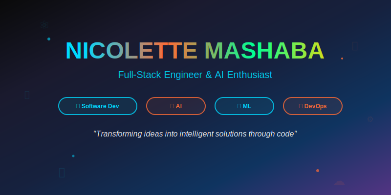

<div align="center">
  
</div>

<div align="center">
  <a href="https://nickimash.vercel.app/">
    
  </a>
  <a href="mailto:nene171408@gmail.com">
    
  </a>
  <a href="https://www.linkedin.com/in/nicolette-mashaba-b094a5221/">
    
  </a>
  <a href="https://x.com/m_neyi">
    
  </a>
</div>

<br />

<div align="center">
  <a href="https://user-badge.committers.top/south_africa/NickiMash17">
    
  </a>
</div>

<br />

<div align="center">
  
</div>

---

<div align="center">
  
</div>

## 🚀 **THE ARCHITECT BEHIND THE CODE**


```typescript
class AIEngineer {
  name = "Nicolette Mashaba";
  role = "Software Developer & AI Specialist";
  location = "South Africa 🇿🇦";
  
  currentFocus = [
    "Building intelligent applications with AI/ML",
    "Cloud-native development with modern frameworks",
    "DevOps automation & CI/CD pipelines",
    "Full-stack development with cutting-edge tech"
  ];
  
  aiExpertise = [
    "Machine Learning model development",
    "Natural Language Processing",
    "Computer Vision applications", 
    "MLOps & model deployment"
  ];
  
  mindset = "Code is art, AI is the future";
  
  getVision(): string {
    return "Bridging the gap between human creativity and artificial intelligence";
  }
}
```

<div align="center">
  
</div>

<br clear="right"/>

---

## 🛠️ **TECHNOLOGY ARSENAL**

<div align="center">

### **💻 Software Development**


### **🤖 AI & Machine Learning**


### **🚀 DevOps & Cloud**


### **🗄️ Data & Analytics**


</div>

<details>
<summary><b>🔧 Complete Technology Stack</b></summary>
<br>

<div align="center">
  
**Languages:**


**Frontend:**


**Backend & APIs:**


**AI/ML Tools:**


**DevOps Tools:**


</div>
</details>

---

## 🏆 **FLAGSHIP PROJECTS**

<div align="center">
  <table width="100%">
    <tr>
      <td width="50%" valign="top">
        <div align="center">
          <h3>🤖 <b>AI-Powered Analytics Platform</b></h3>
          
          <p><b>Machine Learning Dashboard</b></p>
          <p>🧠 <em>TensorFlow | Python | React | Docker</em></p>
          <p>
            
            
            
          </p>
          <a href="#"></a>
          <a href="#"></a>
        </div>
      </td>
      <td width="50%" valign="top">
        <div align="center">
          <h3>🚀 <b>DevOps Automation Suite</b></h3>
          
          <p><b>CI/CD & Infrastructure as Code</b></p>
          <p>⚙️ <em>Kubernetes | Terraform | Azure | GitHub Actions</em></p>
          <p>
            
            
            
          </p>
          <a href="#"></a>
          <a href="#"></a>
        </div>
      </td>
    </tr>
    <tr>
      <td width="50%" valign="top">
        <div align="center">
          <h3>🧠 <b>NLP Chatbot Framework</b></h3>
          
          <p><b>Intelligent Conversational AI</b></p>
          <p>💬 <em>OpenAI API | FastAPI | React | PostgreSQL</em></p>
          <p>
            
            
            
          </p>
          <a href="#"></a>
          <a href="#"></a>
        </div>
      </td>
      <td width="50%" valign="top">
        <div align="center">
          <h3>🏡 <b>Smart Real Estate Platform</b></h3>
          
          <p><b>AI-Enhanced Property Management</b></p>
          <p>🏠 <em>MERN Stack | ML Price Prediction | Maps API</em></p>
          <p>
            
            
            
          </p>
          <a href="#"></a>
          <a href="#"></a>
        </div>
      </td>
    </tr>
  </table>
</div>

---

## 📈 **PERFORMANCE METRICS**

<div align="center">
  
  
</div>

<div align="center">
  
</div>

<div align="center">
  
</div>

---

## 🎯 **LEARNING & GROWTH TRAJECTORY**

<div align="center">
  <table>
    <thead>
      <tr>
        <th>🎯 Focus Area</th>
        <th>📊 Progress</th>
        <th>🚀 Target</th>
        <th>💡 Impact</th>
      </tr>
    </thead>
    <tbody>
      <tr>
        <td><b>AI/ML Engineering</b></td>
        <td></td>
        <td>Q2 2025</td>
        <td>Production AI Systems</td>
      </tr>
      <tr>
        <td><b>MLOps & Model Deployment</b></td>
        <td></td>
        <td>July 2025</td>
        <td>Scalable ML Pipelines</td>
      </tr>
      <tr>
        <td><b>Cloud-Native AI</b></td>
        <td></td>
        <td>June 2025</td>
        <td>Enterprise AI Solutions</td>
      </tr>
      <tr>
        <td><b>DevOps Automation</b></td>
        <td></td>
        <td>Mastery Achieved</td>
        <td>Zero-Downtime Deployments</td>
      </tr>
    </tbody>
  </table>
</div>

---

## 💼 **PROFESSIONAL HIGHLIGHTS**

<div align="center">
  
</div>

<div align="center">
  <table>
    <tr>
      <td align="center">
        
        <br><b>Intelligent Solutions</b>
      </td>
      <td align="center">
        
        <br><b>Automated Workflows</b>
      </td>
      <td align="center">
        
        <br><b>Scalable Infrastructure</b>
      </td>
      <td align="center">
        
        <br><b>Technical Mentorship</b>
      </td>
    </tr>
  </table>
</div>

---

## 📚 **KNOWLEDGE SHARING & RESEARCH**

<div align="center">
  <h3>🚀 Latest Technical Articles & Research</h3>
  <table>
    <tr>
      <td>
        <a href="#" target="_blank">
          
        </a>
        <br><em>MLOps best practices with Azure ML & Kubernetes</em>
      </td>
    </tr>
    <tr>
      <td>
        <a href="#" target="_blank">
          
        </a>
        <br><em>Building scalable conversational AI with OpenAI & FastAPI</em>
      </td>
    </tr>
    <tr>
      <td>
        <a href="#" target="_blank">
          
        </a>
        <br><em>Automating ML model deployment with CI/CD</em>
      </td>
    </tr>
    <tr>
      <td>
        <a href="#" target="_blank">
          
        </a>
        <br><em>Deploying vision models with TensorFlow Serving</em>
      </td>
    </tr>
  </table>
</div>

---

## 🎵 **CODING AMBIANCE**

<div align="center">
  <table>
    <tr>
      <td align="center">
        
      </td>
      <td>
        <h4>🎧 Current AI Development Playlist:</h4>
        <ul align="left">
          <li>🌊 Deep Focus Electronic</li>
          <li>🤖 Synthwave & Cyberpunk</li>
          <li>🧠 Ambient Neural Networks</li>
          <li>⚡ High-Energy Coding Beats</li>
        </ul>
        <a href="https://open.spotify.com/user/317zc24pnfufnhx7w2lghbx4cdau">
          
        </a>
      </td>
    </tr>
  </table>
</div>

---

## 🤝 **LET'S BUILD THE FUTURE WITH AI**

<div align="center">
  
</div>

<div align="center">
  <table>
    <tr>
      <td align="center">
        <a href="mailto:nene171408@gmail.com">
          
        </a>
      </td>
      <td align="center">
        <a href="https://nicolettemashaba.vercel.app/">
          
        </a>
      </td>
      <td align="center">
        <a href="https://www.linkedin.com/in/nicolette-mashaba-b094a5221/">
          
        </a>
      </td>
    </tr>
  </table>
</div>

<div align="center">
  <h3>🧠 "The future is intelligent, and I'm here to build it one algorithm at a time."</h3>
</div>

---

<div align="center">
  
  
</div>

<div align="center">
  
</div>

<!--Animated contribution snake-->
<picture>
  <source media="(prefers-color-scheme: dark)" srcset="https://raw.githubusercontent.com/NickiMash17/NickiMash17/output/github-snake-dark.svg" />
  <source media="(prefers-color-scheme: light)" srcset="https://raw.githubusercontent.com/NickiMash17/NickiMash17/output/github-snake.svg" />
  
</picture>

<div align="center">
  
</div>
