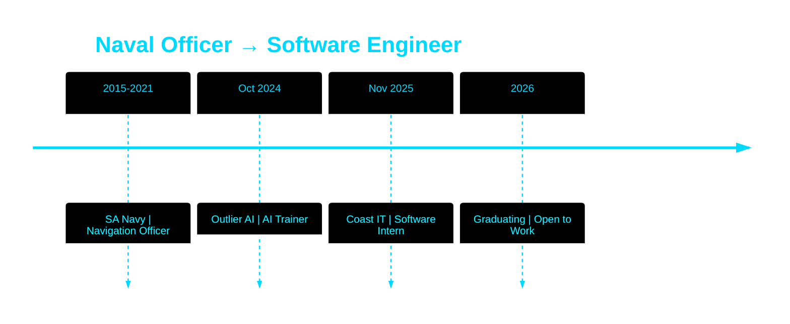

<!-- Animated Wave Header with Particles -->
<div align="center">
  
</div>

<!-- Triple-Lane Animated Typing -->
<div align="center">
  
</div>

<p align="center">
  <a href="https://nicmash-porfolio.vercel.app/"></a>
  <a href="mailto:nene171408@gmail.com"></a>
  <a href="https://www.linkedin.com/in/nicolette-mashaba-b094a5221/"></a>
  <a href="https://x.com/m_neyi"></a>
</p>

<!-- Animated Contribution Snake -->
<div align="center">
  <picture>
    <source media="(prefers-color-scheme: dark)" srcset="https://raw.githubusercontent.com/platane/platane/output/github-contribution-grid-snake-dark.svg">
    <source media="(prefers-color-scheme: light)" srcset="https://raw.githubusercontent.com/platane/platane/output/github-contribution-grid-snake.svg">
    
  </picture>
</div>

<!-- Animated Separator -->


<br>

<!-- Compact Story with Animation -->
<table width="100%">
<tr>
<td width="60%" valign="top">

##  ABOUT ME


```typescript
const nicolette = {
  background: "SA Navy Officer → Software Engineer",
  location: "Polokwane, South Africa 🇿🇦",
  graduation: "2026",
  
  impact: {
    naval: "10% fuel efficiency | 15% downtime reduction",
    ai: "25% model accuracy improvement",
    cloud: "99.9% system uptime achieved"
  },
  
  stack: {
    languages: ["TypeScript", "Python", "C#", "Dart"],
    frontend: ["React", "Next.js", "Flutter"],
    backend: ["Node.js", ".NET", "FastAPI"],
    cloud: ["Azure ☁️", "Docker 🐳", "Terraform"],
    ai: ["OpenAI 🤖", "NLP", "Prompt Engineering"]
  },
  
  achievements: [
    "🏆 AIMS Hackathon 2025 Winner",
    "☁️ Azure Developer Associate (AZ-204)",
    "📊 Azure Data Fundamentals (DP-900)"
  ]
};
```

**My Unique Edge:** Military precision + strategic optimization skills applied to scalable cloud solutions and AI-powered applications.

</td>
<td width="40%" valign="top" align="center">

<br><br>


<br><br>

###  QUICK FACTS

```
🎖️  Ex-Naval Navigation Officer
🎓  CTU Top Performer 2023
💼  3 Tech Roles | 1 Navy Career
🚀  Open to Work (2026 Graduate)
🌍  Polokwane, SA | Open to Remote
```

</td>
</tr>
</table>

<br>

<!-- Animated Tech Stack -->
<div align="center">

##  TECH ARSENAL

<p align="center">
  
</p>


</div>


<!-- Animated Projects Section -->
<div align="center">

##  FLAGSHIP PROJECTS

</div>

<table width="100%">
<tr>
<td width="33%" align="center" valign="top">


### 🤖 EmpowerAI

**AI Career Platform**

South Africa's Digital Economic Twin for youth empowerment.

**Features:**
- AI Chatbot (GPT-4)
- CV Intelligence
- Interview Simulator
- Economic Forecasting

**Tech:** React • Node.js • Python • OpenAI • Azure

<a href="#"></a>

</td>
<td width="33%" align="center" valign="top">


### 🛡️ AI Compliance Interrogator

**Hackathon Winner** 🥇

AI-powered platform combating human trafficking through NLP analysis.

**Achievement:**
- AIMS 2025 Winner
- 99.9% uptime
- Real-time detection

**Tech:** React • .NET Core 8 • OpenAI • Azure

<a href="#"></a>

</td>
<td width="33%" align="center" valign="top">


### 🌱 FitQuest

**Mobile Wellness App**

Gamified tracker with evolving plant companion.

**Features:**
- Cross-Platform
- Plant Evolution
- 80% Test Coverage
- Offline-First

**Tech:** Flutter • Dart • Firebase • BLoC

<a href="#"></a>

</td>
</tr>
</table>


<!-- Animated Stats Grid -->
<div align="center">

##  GITHUB ANALYTICS

<table width="100%">
<tr>
<td width="50%">


</td>
<td width="50%">


</td>
</tr>
</table>


<table width="100%">
<tr>
<td width="50%">


</td>
<td width="50%">


</td>
</tr>
</table>

</div>

<!-- Animated Trophy Case -->
<div align="center">

##  ACHIEVEMENTS


</div>


<!-- Impact Metrics with Animation -->
<div align="center">

##  REAL-WORLD IMPACT

<table>
<tr>
<td align="center" width="25%">
<br>
<b>+25%</b><br>
<sub>AI Model Accuracy</sub>
</td>
<td align="center" width="25%">
<br>
<b>10hrs/week</b><br>
<sub>Time Saved</sub>
</td>
<td align="center" width="25%">
<br>
<b>-10%</b><br>
<sub>Fuel Efficiency</sub>
</td>
<td align="center" width="25%">
<br>
<b>99.9%</b><br>
<sub>System Uptime</sub>
</td>
</tr>
</table>

</div>


<!-- Career Timeline -->
<div align="center">

##  CAREER JOURNEY



</div>


<!-- Animated Footer CTA -->
<div align="center">

##  LET'S BUILD SOMETHING


<br>

<a href="mailto:nene171408@gmail.com">
  
</a>
<a href="https://nicmash-porfolio.vercel.app/">
  
</a>
<a href="https://www.linkedin.com/in/nicolette-mashaba-b094a5221/">
  
</a>

<br><br>


<br>

<sub>⚓ <b>From Navigating Oceans to Architecting Code</b> ⚓</sub>

</div>

<!-- Animated Wave Footer -->

