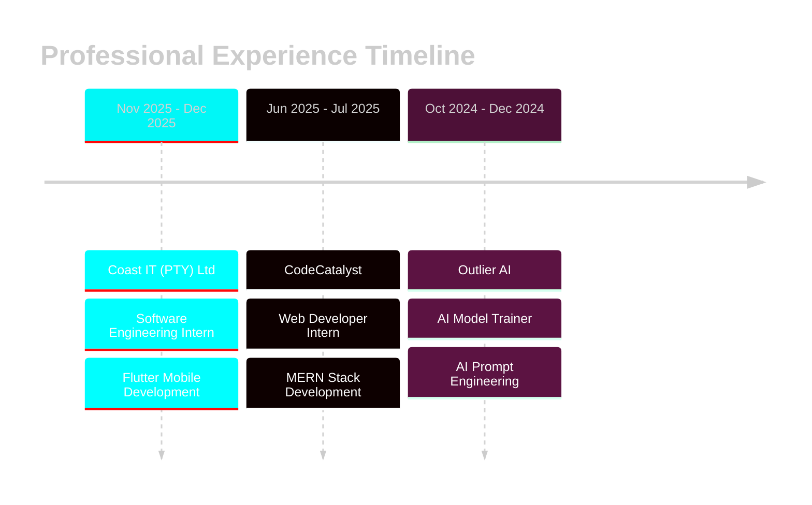

<!-- Glitch Effect Header -->
<div align="center">
  
</div>

<!-- Dynamic Typing Animation with Cyber Theme -->
<div align="center">
  
</div>

<!-- Neon-styled Contact Badges -->
<div align="center">
  <a href="https://nickimash.vercel.app/">
    
  </a>
  <a href="mailto:nene171408@gmail.com">
    
  </a>
  <a href="https://www.linkedin.com/in/nicolette-mashaba-b094a5221/">
    
  </a>
  <a href="https://x.com/m_neyi">
    
  </a>
  <a href="https://github.com/NickiMash17">
    
  </a>
</div>

<br>

<!-- Elite Developer Badge -->
<div align="center">
  <a href="https://user-badge.committers.top/south_africa/NickiMash17">
    
  </a>
</div>

<!-- Activity Graph with Custom Styling -->
<div align="center">
  
</div>

<br>

<!-- Cosmic Divider -->
<div align="center">
  
</div>

## 🎯 **CURRENTLY FOCUSED ON**


```javascript
const nicolette = {
  identity: {
    name: "Nicolette Mashaba",
    title: "Software Engineering Student",
    location: "Polokwane, South Africa 🇿🇦",
    expectedGrad: "2026",
    motto: "Code with purpose, build with passion"
  },
  
  currentMission: [
    "🏢 Software Engineering Intern @ Coast IT",
    "📱 Crafting Flutter mobile experiences",
    "☁️ Architecting Azure cloud solutions",
    "🤖 Exploring AI/ML integrations",
    "🚀 Building production-grade applications"
  ],
  
  techArsenal: {
    frontend: ["React", "TypeScript", "Tailwind CSS", "Vite"],
    backend: ["Node.js", ".NET Core", "Express", "Prisma"],
    mobile: ["Flutter", "Dart"],
    cloud: ["Azure", "Docker", "Terraform", "Kubernetes"],
    databases: ["MongoDB", "SQL Server"],
    ai: ["OpenAI API", "Natural Language Processing"]
  },
  
  achievements: {
    hackathons: "🏆 AIMS 2025 Winner",
    certifications: "🎓 Azure Developer Associate (AZ-204)",
    recognition: "⭐ CTU Top Performer 2023",
    experience: "💼 3+ Professional Internships"
  },
  
  philosophy: "Clean code, scalable architecture, continuous innovation",
  
  getCurrentGoal: () => {
    return "Seeking full-time opportunities to build impactful software solutions 🎯";
  }
};

console.log(nicolette.getCurrentGoal());
// Output: "Seeking full-time opportunities to build impactful software solutions 🎯"
```

<br clear="right"/>

<!-- Animated Status Bar -->
<div align="center">
  
</div>

---

## 🛠️ **TECHNICAL ECOSYSTEM**

<!-- Tech Stack in Grid Layout -->
<div align="center">

### **⚡ LANGUAGES & FRAMEWORKS**
<table>
  <tr>
    <td align="center" width="96">
      
      <br>JavaScript
    </td>
    <td align="center" width="96">
      
      <br>TypeScript
    </td>
    <td align="center" width="96">
      
      <br>Python
    </td>
    <td align="center" width="96">
      
      <br>C#
    </td>
    <td align="center" width="96">
      
      <br>C
    </td>
    <td align="center" width="96">
      
      <br>Dart
    </td>
    <td align="center" width="96">
      
      <br>SQL
    </td>
  </tr>
</table>

### **🎨 FRONTEND TECHNOLOGIES**
<table>
  <tr>
    <td align="center" width="96">
      
      <br>React
    </td>
    <td align="center" width="96">
      
      <br>HTML5
    </td>
    <td align="center" width="96">
      
      <br>CSS3
    </td>
    <td align="center" width="96">
      
      <br>Tailwind
    </td>
    <td align="center" width="96">
      
      <br>Bootstrap
    </td>
    <td align="center" width="96">
      
      <br>Vite
    </td>
  </tr>
</table>

### **⚙️ BACKEND & DATABASES**
<table>
  <tr>
    <td align="center" width="96">
      
      <br>Node.js
    </td>
    <td align="center" width="96">
      
      <br>Express
    </td>
    <td align="center" width="96">
      
      <br>.NET Core
    </td>
    <td align="center" width="96">
      
      <br>Prisma
    </td>
    <td align="center" width="96">
      
      <br>MongoDB
    </td>
    <td align="center" width="96">
      
      <br>SQL Server
    </td>
  </tr>
</table>

### **📱 MOBILE DEVELOPMENT**
<table>
  <tr>
    <td align="center" width="96">
      
      <br>Flutter
    </td>
    <td align="center" width="96">
      
      <br>Dart
    </td>
    <td align="center" width="96">
      
      <br>Firebase
    </td>
  </tr>
</table>

### **☁️ CLOUD & DEVOPS**
<table>
  <tr>
    <td align="center" width="96">
      
      <br>Azure
    </td>
    <td align="center" width="96">
      
      <br>Docker
    </td>
    <td align="center" width="96">
      
      <br>Kubernetes
    </td>
    <td align="center" width="96">
      
      <br>Terraform
    </td>
    <td align="center" width="96">
      
      <br>Git
    </td>
    <td align="center" width="96">
      
      <br>GitHub
    </td>
  </tr>
</table>

</div>

---

## 💼 **CAREER JOURNEY**

<div align="center">
  
<!-- Timeline Style Cards -->


</div>

<div align="center">
<table width="100%">
<tr>
<td align="center" width="33%">

### 🚀 **Coast IT**
**Software Engineering Intern**  
*Nov 2025 - Dec 2025*

```diff
+ Flutter mobile app development
+ Agile team collaboration
+ Full-stack project delivery
+ Cross-platform solutions
```

</td>
<td align="center" width="33%">

### 🌐 **CodeCatalyst**
**Web Developer Intern**  
*Jun 2025 - Jul 2025*

```diff
+ MERN stack development
+ JWT authentication systems
+ 20% faster report generation
+ RESTful API integration
```

</td>
<td align="center" width="33%">

### 🤖 **Outlier AI**
**AI Model Trainer**  
*Oct 2024 - Dec 2024*

```diff
+ 100+ AI prompts refined
+ 25% accuracy improvement
+ 10hrs/week efficiency gain
+ Model optimization
```

</td>
</tr>
</table>
</div>

---

## 🏆 **SIGNATURE PROJECTS**

<!-- Project Showcase with Enhanced Visuals -->
<div align="center">

### 🥇 **AI COMPLIANCE INTERROGATOR**
**🏆 AIMS Hackathon 2025 Winner | Team Firefly**


*Revolutionizing human trafficking prevention through AI-powered analysis*

</div>

**🎯 Project Impact:**
- Automated analysis of complex trafficking patterns using NLP
- Real-time dashboard with actionable intelligence
- Secure Azure cloud deployment with enterprise-grade security
- OpenAI API integration for intelligent pattern recognition

**🔧 Tech Stack:**
```
Frontend:  React + TypeScript + Tailwind CSS
Backend:   .NET Core + SQL Server
Cloud:     Microsoft Azure (App Services + Functions)
AI/ML:     OpenAI API + Natural Language Processing
```

<div align="center">
  
  
  
  
  
</div>

---

### 🌐 **FULL-STACK WEB PLATFORM**
**Production-Ready MERN Applications | CodeCatalyst Portfolio**

<div align="center">

</div>

**✨ Key Features:**
- 🔐 Robust JWT authentication with refresh tokens
- 💳 Stripe payment gateway integration
- 📧 Automated email notification system
- 📱 Fully responsive Tailwind UI/UX
- 🗄️ Efficient MongoDB data management
- 🔌 RESTful API architecture

**🔧 Tech Stack:**
```
Frontend:  React + Vite + Tailwind CSS
Backend:   Node.js + Express + MongoDB
Tools:     JWT + Stripe API + Nodemailer
```

<div align="center">
  
  
  
  
</div>

---

### 📱 **FLUTTER MOBILE SUITE**
**Cross-Platform Mobile Applications | Coast IT Projects**

<div align="center">

</div>

**🎨 Development Focus:**
- 📱 iOS & Android deployment from single codebase
- 🎨 Material Design 3 implementation
- 🔄 Efficient state management (Provider/Riverpod)
- 🌐 RESTful API integration
- 🚀 Agile development methodology

**🔧 Tech Stack:**
```
Framework: Flutter 3.x + Dart
State:     Provider + Riverpod
Backend:   Firebase + REST APIs
UI/UX:     Material Design 3
```

<div align="center">
  
  
  
</div>

---

### ☁️ **AZURE CLOUD SOLUTIONS**
**Enterprise-Grade Cloud Architecture | AZ-204 Certified Projects**

<div align="center">

</div>

**☁️ Cloud Expertise:**
- ⚡ Serverless Azure Functions & Logic Apps
- 🔄 CI/CD pipelines with Azure DevOps
- 🐳 Containerization with Docker + AKS
- 🏗️ Infrastructure as Code (Terraform)
- 🔒 Secure key management (Azure Key Vault)
- 📊 Monitoring with Application Insights

**🔧 Tech Stack:**
```
Platform:  Microsoft Azure
Compute:   Azure Functions + App Services + AKS
IaC:       Terraform + ARM Templates
CI/CD:     Azure DevOps + GitHub Actions
```

<div align="center">
  
  
  
  
</div>

---

## 📊 **GITHUB ANALYTICS**

<div align="center">
  
  
</div>

<div align="center">
  
</div>

<div align="center">
  
</div>

<!-- Contribution Snake Animation -->
<div align="center">
  <picture>
    <source media="(prefers-color-scheme: dark)" srcset="https://raw.githubusercontent.com/NickiMash17/NickiMash17/output/github-snake-dark.svg" />
    <source media="(prefers-color-scheme: light)" srcset="https://raw.githubusercontent.com/NickiMash17/NickiMash17/output/github-snake.svg" />
    
  </picture>
</div>

---

## 🎓 **EDUCATION & CREDENTIALS**

<div align="center">
<table width="100%">
<tr>
<td width="50%" valign="top">

### 🎓 **ACADEMIC BACKGROUND**

```yaml
Current Education:
  Institution: CTU Training Solutions
  Program: Occupational Certificate - Software Engineering
  Level: NQF 6
  Expected Graduation: 2026
  Focus Areas:
    - Full-Stack Development
    - Cloud Computing
    - Mobile App Development
    - Software Architecture

Foundation:
  Institution: CTU Training Solutions
  Program: IT Programming Foundation
  Level: NQF 4
  Graduated: 2024
  Achievement: ⭐ Top Performer 2023
```

</td>
<td width="50%" valign="top">

### 📜 **CERTIFICATIONS**


**AZ-204: Azure Developer Associate**  
*Developing Solutions for Microsoft Azure*


**DP-900: Azure Data Fundamentals**  
*Core Data Concepts & Services*


**Web Development Specialization**  
*Basics, Plus & Responsive Design*


**Software Development Bootcamp**  
*Intensive Training Program*

</td>
</tr>
</table>
</div>

---

## 🏅 **ACHIEVEMENTS & RECOGNITION**

<div align="center">

| 🏆 Achievement | 📋 Details | 📅 Year |
|:---:|:---:|:---:|
| **AIMS Hackathon Winner** | 🥇 Best Team - Application & Visualisation<br>*AI Compliance Interrogator Project* | 2025 |
| **Azure Certified Developer** | ☁️ Microsoft AZ-204 Developer Associate<br>*Cloud Development Expertise* | 2024 |
| **CTU Top Performer** | ⭐ Programming Foundation Excellence<br>*Outstanding Academic Achievement* | 2023 |
| **J.P. Morgan Simulation** | 💼 Midas Core Software Engineering<br>*Forage Platform Completion* | 2025 |
| **Multiple Internships** | 🚀 Coast IT, CodeCatalyst, Outlier AI<br>*Diverse Industry Experience* | 2024-2025 |

</div>

---

## 💡 **EXPERTISE MATRIX**

<div align="center">
<table width="100%">
<tr>
<td width="50%" valign="top">

### 💻 **TECHNICAL COMPETENCIES**

```python
technical_skills = {
    "full_stack_development": {
        "proficiency": "⭐⭐⭐⭐⭐",
        "tech": ["MERN", ".NET Core", "REST APIs"]
    },
    "mobile_development": {
        "proficiency": "⭐⭐⭐⭐⭐",
        "tech": ["Flutter", "Dart", "Cross-platform"]
    },
    "cloud_computing": {
        "proficiency": "⭐⭐⭐⭐⭐",
        "tech": ["Azure", "Docker", "Kubernetes"]
    },
    "databases": {
        "proficiency": "⭐⭐⭐⭐",
        "tech": ["MongoDB", "SQL Server", "Prisma"]
    },
    "ai_integration": {
        "proficiency": "⭐⭐⭐⭐",
        "tech": ["OpenAI API", "NLP", "ML Models"]
    },
    "devops": {
        "proficiency": "⭐⭐⭐⭐",
        "tech": ["CI/CD", "Terraform", "Azure DevOps"]
    }
}
```

</td>
<td width="50%" valign="top">

### 🎯 **PROFESSIONAL ATTRIBUTES**

```typescript
interface ProfessionalSkills {
  problem_solving: {
    level: "Expert";
    approach: "Analytical & Creative";
  };
  team_collaboration: {
    level: "Advanced";
    methodology: "Agile/Scrum";
  };
  learning_agility: {
    level: "Fast Learner";
    mindset: "Growth-Oriented";
  };
  communication: {
    level: "Effective";
    style: "Clear & Collaborative";
  };
  project_management: {
    level: "Proficient";
    tools: ["Jira", "Trello", "Azure Boards"];
  };
  mentorship: {
    level: "Experienced";
    passion: "Knowledge Sharing";
  };
}
```

</td>
</tr>
</table>
</div>

---

## 🌟 **LET'S BUILD SOMETHING AMAZING**

<div align="center">
  
</div>

<br>

<div align="center">
  <table>
    <tr>
      <td align="center">
        <a href="mailto:nene171408@gmail.com">
          
        </a>
        <br><sub>Direct Communication</sub>
      </td>
      <td align="center">
        <a href="https://nickimash.vercel.app/">
          
        </a>
        <br><sub>Explore My Work</sub>
      </td>
      <td align="center">
